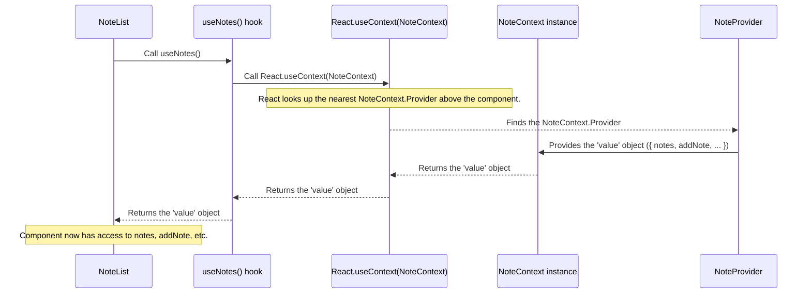

# Chapter 1: State Management (React Contexts)

Welcome to the first chapter of the Quillon tutorial! We're going to start by understanding a fundamental concept in building interactive applications like Quillon: managing the "state" of your application. Think of state as all the dynamic information that changes as you use the app – like the list of notes you have, whether a note is being edited, or what search term you've typed.

### The Problem with Passing Data

Imagine you have different parts of your application, like the area that shows your list of notes (`NoteList`), a separate component for adding a new note (`NoteEditor`), and maybe another component for applying filters (`NoteFilters`). These different parts often need access to the *same* information (like the list of notes) or need to *change* that information (like adding a new note).

In React, data usually flows down from parent components to child components through something called "props". If you have deeply nested components, passing data down multiple levels can become cumbersome and hard to track. It's like trying to pass a message across a crowded room by whispering it to the person next to you, who whispers it to the next, and so on. This is often called "prop drilling".

### The Shared Whiteboard: React Contexts

This is where **React Contexts** come in! They offer a way to share data throughout your component tree without having to pass props manually at every level. Think of a Context as a **shared whiteboard** that different parts of your application can access and write on.

Instead of drilling props down, components can subscribe to this shared whiteboard and grab the specific piece of information they need, or use the functions available on the whiteboard to update the shared data.

In Quillon, we use Contexts as central "storage areas" or data hubs for important information:

*   `NoteContext`: This is our main whiteboard for everything related to notes. It holds the list of notes, the current search term, selected filters, and even the state of the private space feature.
*   `DocumentContext`: This whiteboard is specifically for managing the list of uploaded files.

Any component that needs to display a note, add a note, apply a filter, or check if the private space is unlocked, can simply "look at" or "write on" the `NoteContext` whiteboard without needing props from its parent. Similarly, components dealing with files interact with the `DocumentContext`.

Let's see how a component uses this shared whiteboard.

### Accessing Shared State: Using the Whiteboard

In Quillon, components don't directly touch the whiteboard. Instead, they use a special hook provided by the Context, like `useNotes` for `NoteContext`. This hook acts like asking the "whiteboard manager" for the information or tools you need.

Look at the `NoteList` component in `src/App.tsx`. It needs to display the list of notes, apply filters, and perform actions like adding or updating notes.

Here's how it gets that information using `useNotes()`:

```typescript
// src/App.tsx (Simplified Snippet)
function NoteList() {
  // This hook gives us access to the NoteContext's value
  const {
    notes, // The list of notes
    searchTerm, // The current search term
    selectedTags, // Currently selected tags
    showStarredOnly, // Whether to show only starred notes
    showPrivateNotes, // Whether to show private notes
    showTrash, // Whether to show trash
    // ... and functions to update this state
    addNote,
    updateNote,
    // ... many other properties and functions
  } = useNotes();

  // ... rest of the component logic using these values
}
```

**Explanation:**

*   `useNotes()` is a **custom hook** that wraps the standard React `useContext` hook.
*   By calling `useNotes()`, the `NoteList` component gets an object containing all the shared data (like `notes`, `searchTerm`, etc.) and functions (like `addNote`, `updateNote`) that are provided by the `NoteContext`.
*   Now, `NoteList` can access `notes` to display them, use `searchTerm` and other state variables to filter the list, and call `addNote` or `updateNote` to change the notes data, all without receiving them as props from its parent.

This makes `NoteList` much cleaner and less dependent on its parent component knowing *how* to get the note data. It just asks the `NoteContext` manager!

### How it Works Under the Hood

Let's peek behind the curtain to understand the core parts of a React Context:

1.  **Creating the Context:** You first create the "whiteboard" itself using `React.createContext`.

    ```typescript
    // src/context/NoteContext.tsx (Simplified)
    import React, { createContext, useContext, useState } from 'react';
    import { Note, NoteContextType } from '../types'; // Import types

    // 1. Create the Context whiteboard
    const NoteContext = createContext<NoteContextType | undefined>(undefined);

    // ... rest of the code
    ```

    *   `createContext` creates the Context object.
    *   We provide a default value (`undefined` here, meaning "no provider yet") and specify the expected shape of the data (`NoteContextType`).

2.  **Providing the State and Functions:** A component, typically near the root of your application tree, acts as the "whiteboard manager". This is called the **Provider**. It holds the actual state (using `useState` or `useReducer`) and defines the functions that can update that state. It then makes all of this available through the Context.

    ```typescript
    // src/context/NoteContext.tsx (Simplified)
    // ... imports and createContext ...

    // 2. Create the Provider component (The Whiteboard Manager)
    export function NoteProvider({ children }: { children: React.ReactNode }) {
      // The actual state is held here
      const [notes, setNotes] = useState<Note[]>([]);
      const [searchTerm, setSearchTerm] = useState('');
      // ... other state variables

      // Functions to update the state
      const addNote = (note: Omit<Note, 'id' | 'createdAt' | 'updatedAt'>) => {
        // Logic to add note and update 'notes' state
        setNotes(prev => [...prev, { /* new note data */ }]);
      };
      // ... other functions like updateNote, setSearchTerm, etc.

      // The value object available to consumers
      const contextValue: NoteContextType = {
        notes,
        addNote,
        searchTerm,
        setSearchTerm,
        // ... other state and functions
      };

      return (
        // Make the value available to all children
        <NoteContext.Provider value={contextValue}>
          {children}
        </NoteContext.Provider>
      );
    }

    // ... useNotes hook
    ```

    *   `NoteProvider` is a regular React component.
    *   It uses `useState` (and other hooks like `useEffect` which we'll touch on later) to manage the actual data (`notes`, `searchTerm`, etc.).
    *   It defines functions (`addNote`, `setSearchTerm`, etc.) that components can call to request changes to the state.
    *   It renders `NoteContext.Provider` and passes an object to its `value` prop. This object contains all the state variables and functions that components using this context can access.
    *   `{children}` means whatever components you render *inside* `<NoteProvider>` will have access to this value.

3.  **Consuming the Context:** Components that need to access the shared state or functions use the `useContext` hook.

    ```typescript
    // src/context/NoteContext.tsx (Simplified)
    // ... imports, createContext, and NoteProvider ...

    // 3. Create a custom hook for consuming the context easily
    export function useNotes() {
      // Use the standard useContext hook
      const context = useContext(NoteContext);

      // Add a helpful error check
      if (context === undefined) {
        throw new Error('useNotes must be used within a NoteProvider');
      }

      return context; // Return the value provided by NoteProvider
    }
    ```

    *   The `useNotes` hook calls `useContext` with the `NoteContext` object we created earlier.
    *   This hook automatically gives you the `value` object that was passed to the `NoteContext.Provider` higher up in the component tree.
    *   The error check is a good practice to ensure the hook is only used within a part of the application wrapped by the `NoteProvider`.

### Sequence Diagram: How a Component Gets Data

Let's visualize how `NoteList` gets the `notes` data using the `useNotes` hook:



This diagram shows how the `NoteList` component, by calling `useNotes()`, triggers React's context mechanism to find the `NoteProvider` and retrieve the shared `value` object containing the state (`notes`) and functions (`addNote`, etc.).

### Setting up Contexts in Quillon

To make sure all components can access these whiteboards, the `NoteProvider` and `DocumentProvider` components need to wrap the part of the application where these components live. In Quillon, this happens in the main `App.tsx` file:

```typescript
// src/App.tsx (Simplified)
import React from 'react';
import { NoteProvider } from './context/NoteContext';
// import { DocumentProvider } from './context/DocumentContext'; // Also exists

// NoteList component defined as shown before
function NoteList() {
    // ... uses useNotes()
}

function App() {
  return (
    // We wrap NoteList (and potentially other parts)
    // with NoteProvider so they can access the context.
    <NoteProvider>
      {/* DocumentProvider would also wrap here */}
      {/* <DocumentProvider> */}
        <NoteList />
      {/* </DocumentProvider> */}
    </NoteProvider>
  );
}

export default App;
```

**Explanation:**

*   By placing `<NoteList />` inside `<NoteProvider>`, any component rendered within `NoteList` (or `NoteList` itself) can now use the `useNotes()` hook to access the state and functions provided by `NoteProvider`.
*   `src/main.tsx` then renders the `<App />` component, starting the whole process.

This setup ensures that our core state (`notes`, filters, search, documents) is available globally across the parts of the application that need it, without having to pass this information through many layers of components.

### Conclusion

In this chapter, we learned about the concept of state management in React and how Context API provides a powerful solution to avoid "prop drilling" by acting as a shared data hub or whiteboard. We saw how `NoteContext` and `DocumentContext` serve this purpose in Quillon, and how components like `NoteList` use simple hooks like `useNotes()` to access this shared information and functionality.

Understanding Contexts is key to seeing how Quillon keeps track of all your notes and settings.

Now that we know *how* the state is managed centrally, let's dive into *what* state is being managed – the Notes and Documents themselves!

[Next Chapter: Notes & Documents](02_notes___documents_.md)
