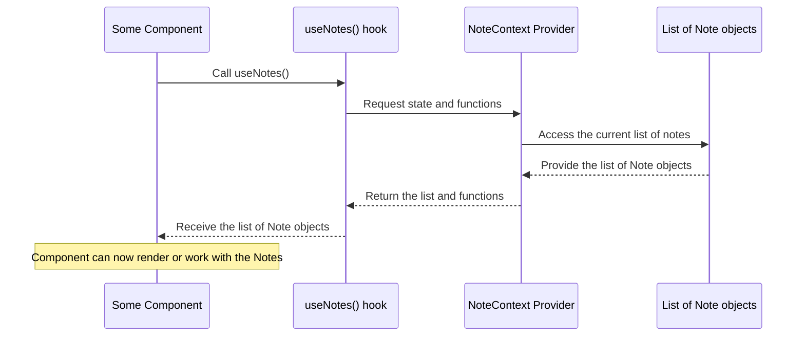

# Chapter 2: Notes & Documents

Welcome back to the Quillon tutorial! In [Chapter 1: State Management (React Contexts)](01_state_management__react_contexts__.md), we learned *how* Quillon keeps track of all the dynamic information in the application using shared "whiteboards" called Contexts. We saw that `NoteContext` holds note-related data and `DocumentContext` holds document-related data.

But what *is* that data exactly? What are the actual "things" you create and manage in Quillon?

That's what this chapter is all about! We'll dive into the core concepts: **Notes** and **Documents**. These are the fundamental pieces of information that Quillon helps you organize.

### Your Digital Items: Notes and Documents

Imagine Quillon as a digital space where you keep track of important information. This information comes in two main forms:

1.  **Notes:** These are like digital pages in a notebook or individual note cards. You write directly into them. They are designed for text-based content and have built-in ways to help you categorize and prioritize them.
2.  **Documents:** These are files you already have (like PDFs, images, spreadsheets) that you upload into Quillon. Quillon stores them and helps you access them easily.

Think of them as the two primary types of items you can put into your Quillon "workspace."

Let's look at each one in more detail.

### Understanding Notes

A **Note** in Quillon is more than just plain text. It's a structured item designed for capturing thoughts, ideas, snippets, or longer pieces of writing.

Here's what makes up a Note:

*   **Title and Content:** The main parts – a title to identify it and the actual text you write.
*   **Tags:** Keywords or labels you add to group notes together (e.g., "ideas," "project-x," "meeting-notes").
*   **Status Flags:** Simple on/off switches to give a note special status:
    *   **Pinned:** Keep it at the top of your list.
    *   **Favorite (or Starred):** Mark it as important.
    *   **Private:** Hide its content unless the private space is unlocked (we'll cover this in [Chapter 6: Private Space Feature](06_private_space_feature_.md)).
    *   **Deleted:** Move it to the trash (not permanently gone yet).
*   **Color:** A visual way to categorize or highlight notes.
*   **Metadata:** Information added automatically, like a unique `id`, when it was `createdAt`, and when it was last `updatedAt`.

**Analogy:** A Note is like a physical sticky note or index card where you write something, maybe add a colored label, star it, or put it on a special corkboard (pin it).

**How Notes are Represented in Code:**

In the project's code, a Note is defined using a TypeScript `interface`. This is like a blueprint that tells us what properties a Note object *must* have and what type of data each property holds (like `string` for text, `boolean` for true/false flags, `string[]` for a list of tags).

You can see this blueprint in `src/types/index.ts`:

```typescript
// src/types/index.ts (Simplified)
export interface Note {
  id: string; // Unique identifier (text)
  title: string; // The note's title (text)
  content: string; // The main text body (text)
  tags: string[]; // A list of text tags
  color: string; // The color identifier (text)
  isPinned: boolean; // Is it pinned? (true/false)
  isFavorite: boolean; // Is it a favorite? (true/false)
  isPrivate: boolean; // Is it private? (true/false)
  isDeleted?: boolean; // Is it deleted? (true/false, optional)
  createdAt: string; // When it was created (date/time as text)
  updatedAt: string; // When it was last changed (date/time as text)
  // ... other properties like viewCount, sharing info
}
```

This `Note` interface tells us exactly the kind of information we can expect when we get a Note object from the `NoteContext`.

**How Notes Appear in the UI:**

Notes are typically shown as cards in a list ([`NoteCard.tsx`](#)) or opened in a larger view for editing ([`NoteEditor.tsx`](#)) or reading ([`NoteViewer.tsx`](#)).

Let's look at a snippet from the `NoteCard` component. It receives a `note` object as a "prop" (data passed into the component).

```typescript
// src/components/NoteCard.tsx (Simplified)
interface NoteCardProps {
  note: Note; // The Note object is passed here
  // ... other props
}

export function NoteCard({ note, onEdit }: NoteCardProps) {
  // We can access properties directly from the 'note' object
  const { title, content, tags, isFavorite, isPrivate, isPinned, updatedAt } = note;

  // ... Use these properties to display the card UI
  // <h3 className="..."> {title} </h3>
  // <p className="..."> {content} </p>
  // {isPrivate && <LockIcon />}
  // {isFavorite && <StarIcon />}
  // ... buttons that might call useNotes().updateNote(note.id, ...)
}
```

This shows how the `NoteCard` component uses the data *inside* the `note` object it receives.

**How Notes Interact with Context (Recap):**

Remember from [Chapter 1](01_state_management__react_contexts__.md), the `NoteContext` holds an array of these `Note` objects (`notes: Note[]`). When you call `useNotes()`, you get access to this array and functions like `addNote`, `updateNote`, and `deleteNote`. These functions are how the UI tells the `NoteContext` to add, change, or remove `Note` objects from its central list.

**Simple Use Case: Adding a New Note**

1.  The user clicks a "New Note" button in the UI.
2.  This opens the `NoteEditor` component.
3.  The user types a Title, Content, adds Tags, etc.
4.  The user clicks "Save".
5.  The `NoteEditor` component gathers all the entered information into a new object that looks like a `Note` (but without the auto-generated `id`, `createdAt`, `updatedAt` yet).
6.  The `NoteEditor` calls the `addNote` function, which it got from `useNotes()`.
7.  The `addNote` function (inside the `NoteContext` provider) creates a unique `id`, adds timestamps, adds the new Note object to its `notes` array state, and saves the updated list (more on saving in the next chapter!).
8.  Because other components like `NoteList` are also using `useNotes()` and are watching the `notes` array, they automatically update to show the new note!

This flow shows how the structured `Note` data moves from user input in a component, through a Context function, and into the central application state.

### Understanding Documents

A **Document** in Quillon is specifically for files you upload. Unlike Notes, you don't write the content *within* Quillon; you bring the content *to* Quillon as a file.

Here's what makes up a Document:

*   **Name:** The name of the file (e.g., "MyReport.pdf").
*   **Type:** The file type (e.g., "application/pdf", "image/png").
*   **Size:** How large the file is.
*   **URL:** The location where the file can be accessed or downloaded from (in Quillon's case, this will be a special URL for local storage).
*   **Status Flags:**
    *   **Pinned:** Keep it at the top of the document list.
    *   **Starred:** Mark it as important (similar to Note favorites).
*   **Metadata:** When it was `createdAt` and `updatedAt`.

**Analogy:** A Document is like a file folder holding a specific paper document (PDF, image, etc.). You put the whole folder into your Quillon filing cabinet.

**How Documents are Represented in Code:**

Documents also have their own TypeScript `interface`, similar to Notes, but with properties specific to files.

This blueprint is in `src/types/document.ts`:

```typescript
// src/types/document.ts (Simplified)
export interface Document {
  id: string; // Unique identifier (text)
  name: string; // File name (text)
  type: string; // MIME type (text)
  size: number; // File size in bytes (number)
  url: string; // Access URL (text)
  isPinned: boolean; // Is it pinned? (true/false)
  isStarred: boolean; // Is it starred? (true/false)
  createdAt: string; // When it was added (date/time as text)
  updatedAt: string; // When it was last updated (date/time as text)
}
```

**How Documents Appear in the UI:**

Documents are shown in a separate list ([`DocumentList.tsx`](#)), typically as cards ([`DocumentCard.tsx`](#)).

Let's see a snippet from the `DocumentCard` component:

```typescript
// src/components/DocumentCard.tsx (Simplified)
import { Document } from '../types/document';

interface DocumentCardProps {
  document: Document; // The Document object is passed here
  // ... other props
}

export function DocumentCard({ document }: DocumentCardProps) {
  // Access properties from the 'document' object
  const { name, size, type, isStarred, isPinned, updatedAt } = document;

  // ... Use these properties to display the card UI
  // <h3 className="..."> {name} </h3>
  // <div className="..."> {(size / ...).toFixed(2)} MB </div>
  // {isStarred && <StarIcon />}
  // ... buttons that might call useDocuments().updateDocument(document.id, ...)
}
```

Similar to Notes, the `DocumentCard` component uses the specific properties of the `Document` object it receives to display relevant information about the file.

**How Documents Interact with Context (Recap):**

The `DocumentContext` manages an array of `Document` objects (`documents: Document[]`). The `useDocuments()` hook gives components access to this array and functions like `addDocument`, `updateDocument`, and `deleteDocument`. These are the ways the UI components interact with the central list of documents.

**Simple Use Case: Viewing the Document List**

1.  When the part of the application that shows documents loads, the `DocumentList` component is rendered.
2.  `DocumentList` calls the `useDocuments()` hook.
3.  `useDocuments()` gets the current list of `Document` objects (`documents` array) from the `DocumentContext`.
4.  `DocumentList` receives this array and then renders a `DocumentCard` component for *each* `Document` object in the array, passing the individual `Document` object as a prop to each card.
5.  Each `DocumentCard` uses the data within its specific `Document` prop to display the file name, size, date, etc.

This shows how components consume the list of `Document` objects stored centrally in the Context to display the document list.

### Notes vs. Documents: A Quick Comparison

While both are core items in Quillon and are managed by React Contexts, they serve different purposes and have different structures:

| Feature        | Note                          | Document                        |
| :------------- | :---------------------------- | :------------------------------ |
| **Content**    | Text written *in* the app     | File uploaded *to* the app      |
| **Primary Data**| Title, Content (text)       | Name, URL (file reference)      |
| **Metadata**   | Tags, Color, Pinned, Favorite, Private, Deleted | Type, Size, Pinned, Starred |
| **Management** | `NoteContext`                 | `DocumentContext`               |

They are distinct types of data, each with their own properties and use cases within the application.

### Connecting the Dots

In summary, Notes and Documents are the fundamental data "payloads" in Quillon. They are structured objects (defined by TypeScript interfaces) that represent the information the user wants to store and organize.

[Chapter 1](01_state_management__react_contexts__.md) explained the "storage mechanism" (React Contexts). This chapter explained *what* is being stored (Notes and Documents, with their specific properties).

Components in Quillon (like `NoteCard`, `NoteEditor`, `DocumentCard`, `DocumentList`) interact with these objects: they receive them as props, display their information, and use the Context functions (`addNote`, `updateDocument`, etc.) to request changes to the central lists of Notes and Documents held in the Contexts.

Here's a very simple flow showing how a component might get a Note:



This diagram illustrates how a component accesses the structured `Note` objects from the central `NoteContext`. A similar diagram would apply for `Document` objects using `useDocuments()`.

You'll see these `Note` and `Document` objects passed around and manipulated throughout the application's components and context logic.

Now that we understand the core data types and how Contexts manage them in memory, the next crucial step is to make sure this data isn't lost when you close the application.

[Next Chapter: Local Data Persistence](03_local_data_persistence_.md)
