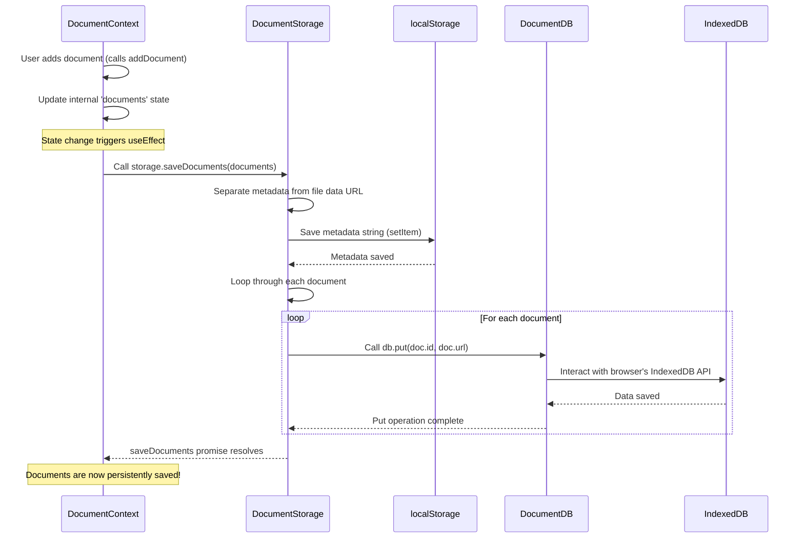

# Chapter 3: Local Data Persistence

Welcome back to the Quillon tutorial! In the last two chapters, we built a solid foundation: [Chapter 1: State Management (React Contexts)](01_state_management__react_contexts__.md) taught us how Quillon keeps track of all its dynamic information in memory using shared "whiteboards," and [Chapter 2: Notes & Documents](02_notes___documents_.md) explained *what kind* of information (Notes and Documents) lives on those whiteboards.

But there's a crucial piece missing: what happens to all your precious Notes and Documents when you close your web browser? If the data only exists on the Context whiteboards while the app is running, it would disappear as soon as the browser tab is closed! That would make Quillon not very useful.

The problem is that the data in our React state (`useState` in the Context providers) is temporary. It's like writing on a physical whiteboard – great for seeing and changing things right now, but it's gone the moment you wipe the board or leave the room.

We need a way for the data to **stick around** even after the browser is closed and reopened. This is where the concept of **Local Data Persistence** comes in.

### Making Data Sticky: Local Persistence

"Persistence" just means making something last or endure. "Local" means it stays right here, on *your* computer, within your web browser, without needing to send it to a server on the internet.

**Use Case Example:**

Imagine you open Quillon, create a new note, type something important, and close the tab. When you open Quillon again, you absolutely expect that note to be there, right? Local Data Persistence is the system that makes this possible. It saves your notes and documents to storage available *inside* your browser.

### How Quillon Achieves Local Persistence

Quillon uses two main tools provided by the web browser to save your data locally:

1.  **`localStorage`:** Think of this as a small, simple storage space in your browser. It's great for saving small bits of information like settings, flags (like whether dark mode is on), or simple lists of items. Data stored here remains until you clear your browser's site data.
2.  **`IndexedDB`:** This is a more powerful, built-in database inside your browser. It can store larger amounts of structured data, including things like files. It's a bit more complex to use than `localStorage`, but necessary for bigger data like the contents of uploaded documents.

Quillon uses a combination of these two:

*   **Note Data:** The entire Note object (title, content, tags, flags, etc.) is saved directly into `localStorage`. Since individual notes aren't expected to be enormous, `localStorage` is sufficient and simpler for this.
*   **Document Data:** This is where it gets a bit more involved because document files can be large. Quillon saves the small piece of information about a document (its name, size, type - called **metadata**) in `localStorage`. But the actual *content* of the file (stored as a data URL) is saved in `IndexedDB`.

This split approach is efficient: `localStorage` for quick access to smaller metadata/notes, and `IndexedDB` for the bulkier file content.

Quillon uses helper code to make working with `IndexedDB` easier. You'll find this wrapper in `src/utils/db.ts`. There's also a `DocumentStorage` class (`src/utils/storage.ts`) that coordinates saving/loading documents, deciding which part goes to `localStorage` and which part goes to `IndexedDB`.

### Using Persistence in Contexts

Remember our Contexts from [Chapter 1](01_state_management__react_contexts__.md)? The Contexts are responsible for holding the *current* state in memory. But they also need to be the ones who tell the persistence system when to **load** data when the app starts and when to **save** data whenever the state changes.

Let's look at how the `NoteContext` and `DocumentContext` handle this.

**Note Persistence (using `localStorage`)**

The `NoteContext` (`src/context/NoteContext.tsx`) loads notes when it initializes and saves them whenever the list of notes changes.

Loading notes happens when the `notes` state variable is first set up:

```typescript
// src/context/NoteContext.tsx (Simplified)
const [notes, setNotes] = useState<Note[]>(() => {
  // This function runs only ONCE when the component mounts
  const savedNotes = localStorage.getItem('notes'); // Try to get notes from localStorage
  return savedNotes ? JSON.parse(savedNotes) : []; // If found, parse and use; otherwise, start empty
});
```

**Explanation:**

*   The `useState` hook's initial value is set using a function. This function runs one time when the `NoteProvider` component is created.
*   Inside the function, we try to get an item named `'notes'` from `localStorage`.
*   `localStorage.getItem()` returns a string (or `null` if nothing is saved).
*   `JSON.parse()` converts the saved string back into a JavaScript array of Note objects.
*   So, when the app starts, the `notes` state is populated with whatever was saved in `localStorage`.

Saving notes happens every time the `notes` array changes. This is handled by a `useEffect` hook:

```typescript
// src/context/NoteContext.tsx (Simplified)
useEffect(() => {
  // This function runs whenever the 'notes' variable changes
  localStorage.setItem('notes', JSON.stringify(notes)); // Convert notes array to string and save
}, [notes]); // The dependency array: run this effect when 'notes' changes
```

**Explanation:**

*   The `useEffect` hook is used to perform side effects, like interacting with the browser's storage.
*   The function inside `useEffect` is simple: it takes the current `notes` array, converts it to a JSON string using `JSON.stringify()`, and saves it in `localStorage` under the key `'notes'`.
*   The `[notes]` at the end is the "dependency array". It tells React to run this effect *only* when the value of the `notes` variable changes. So, whenever you add, update, or delete a note (which updates the `notes` state), this effect runs and saves the latest list to `localStorage`.

This pattern – loading state from storage on initialization and saving state to storage using `useEffect` when it changes – is a common way to handle persistence with `localStorage` in React. Other simple settings like `privateSpacePassword` and `isDarkMode` are saved/loaded in `NoteContext` using the same pattern.

**Document Persistence (using `localStorage` and `IndexedDB`)**

The `DocumentContext` (`src/context/DocumentContext.tsx`) follows a similar pattern but uses the `DocumentStorage` helper class to manage the more complex saving to both `localStorage` and `IndexedDB`.

An instance of `DocumentStorage` is created:

```typescript
// src/context/DocumentContext.tsx (Simplified)
import { DocumentStorage } from '../utils/storage';
const storage = new DocumentStorage(); // Create one instance
```

Loading documents happens on mount using `useEffect`:

```typescript
// src/context/DocumentContext.tsx (Simplified)
useEffect(() => {
  // Load documents when the component first mounts
  storage.loadDocuments().then(setDocuments); // Load and then set the documents state
}, []); // Empty dependency array: run this effect only once on mount
```

**Explanation:**

*   When `DocumentProvider` mounts, this `useEffect` runs.
*   It calls `storage.loadDocuments()`. This function (which we'll look at next) handles reading data from both `localStorage` (metadata) and `IndexedDB` (file content).
*   Since `storage.loadDocuments()` is asynchronous (reading from IndexedDB takes time), it returns a `Promise`. We use `.then()` to wait for the loading to finish and then use `setDocuments` to update the component's `documents` state with the loaded list.

Saving documents happens whenever the `documents` array changes, similar to notes, but it uses `storage.saveDocuments()`:

```typescript
// src/context/DocumentContext.tsx (Simplified)
useEffect(() => {
  // Save documents whenever the 'documents' state changes
  if (documents.length > 0) { // Only try to save if there are documents
    storage.saveDocuments(documents).catch(error => {
      // Handle potential storage errors (like exceeding space)
      // setError(error.message);
    });
  }
}, [documents]); // Dependency array: run when 'documents' changes
```

**Explanation:**

*   This `useEffect` runs whenever `documents` state changes.
*   It calls the asynchronous `storage.saveDocuments(documents)` function.
*   This function handles saving the metadata to `localStorage` and the file data to `IndexedDB`.
*   The `.catch()` is added to handle potential errors during saving, such as the browser's storage limit being reached.

This shows how the `DocumentContext` uses the dedicated `DocumentStorage` helper to manage the loading and saving process, hiding the complexity of dealing with both `localStorage` and `IndexedDB`.

### Under the Hood: DocumentStorage and DocumentDB

Let's briefly peek at how `DocumentStorage` (`src/utils/storage.ts`) and `DocumentDB` (`src/utils/db.ts`) work together to handle documents.

The `DocumentStorage` class acts as a coordinator. It has methods like `saveDocuments`, `loadDocuments`, and `deleteDocument`.

When you call `storage.saveDocuments(documents)`:

```typescript
// src/utils/storage.ts (Simplified saveDocuments)
async saveDocuments(documents: Document[]): Promise<void> {
  // 1. Extract metadata (everything *except* the 'url' which holds the file data)
  const metadata = documents.map(({ url, ...rest }) => rest);

  // 2. Save metadata to localStorage
  localStorage.setItem(METADATA_KEY, JSON.stringify(metadata));

  // 3. Save the actual file data (the 'url') for EACH document to IndexedDB
  await Promise.all(
    documents.map(doc => this.db.put(doc.id, doc.url)) // Use the DocumentDB instance (this.db)
  );
}
```

**Explanation:**

*   It separates the `documents` array into metadata (saved in `localStorage`) and the file data (`url`, saved in `IndexedDB`).
*   It uses `localStorage.setItem` to save the metadata string.
*   It then loops through each document and uses its internal `this.db` instance (which is a `DocumentDB`) to save the document's `url` (the file data) in `IndexedDB`, keyed by the document's `id`. `Promise.all` is used because saving to IndexedDB is asynchronous for each item.

When you call `storage.loadDocuments()`:

```typescript
// src/utils/storage.ts (Simplified loadDocuments)
async loadDocuments(): Promise<Document[]> {
  // 1. Load metadata from localStorage
  const metadata = localStorage.getItem(METADATA_KEY);
  if (!metadata) return []; // Nothing saved yet

  const docs = JSON.parse(metadata); // Parse metadata back into objects

  // 2. Load the actual file data (the 'url') for EACH document from IndexedDB
  const fullDocs = await Promise.all(
    docs.map(async (doc: Omit<Document, 'url'>) => {
      const url = await this.db.get(doc.id); // Use DocumentDB to get the data by ID
      return { ...doc, url }; // Combine metadata and file data back into a full Document object
    })
  );

  // Filter out any documents that failed to load from IndexedDB
  return fullDocs.filter((doc): doc is Document => doc !== null);
}
```

**Explanation:**

*   It first retrieves the document metadata string from `localStorage` and parses it.
*   It then loops through the retrieved metadata objects and for each one, uses its `DocumentDB` instance (`this.db`) to retrieve the corresponding file data (`url`) from `IndexedDB` using the document's `id` as the key.
*   Finally, it combines the metadata and the loaded file data (`url`) back together to reconstruct the full `Document` objects that the `DocumentContext` expects.

The `DocumentDB` class (`src/utils/db.ts`) is a simple wrapper around the browser's native `indexedDB` API. It handles connecting to the database and provides basic methods for `put` (save/update), `get` (load), and `delete` data using a key.

```typescript
// src/utils/db.ts (Simplified DocumentDB)
export class DocumentDB {
  private dbName = 'DocumentStorage';
  private storeName = 'documents';
  private db: IDBDatabase | null = null; // Holds the database connection

  async connect(): Promise<IDBDatabase> {
    // Logic to open/connect to the IndexedDB database
    // Handles 'onupgradeneeded' to create the object store ('documents')
    // Returns the database connection
  }

  async put(id: string, data: string): Promise<void> {
    // Get DB connection via connect()
    // Start a transaction
    // Get the object store ('documents')
    // Call store.put(data, id) to save data keyed by id
  }

  async get(id: string): Promise<string> {
    // Get DB connection via connect()
    // Start a read-only transaction
    // Get the object store ('documents')
    // Call store.get(id) to retrieve data by id
    // Return the retrieved data (the data URL string)
  }

  async delete(id: string): Promise<void> {
    // Get DB connection via connect()
    // Start a transaction
    // Get the object store ('documents')
    // Call store.delete(id) to remove data by id
  }
}
```

**Explanation:**

*   `connect()` handles the low-level details of opening the database.
*   `put(id, data)` saves `data` (the document's URL string) in a specific "object store" (like a table in a database) under the key `id` (the document's unique ID).
*   `get(id)` retrieves the data string associated with the given `id`.
*   `delete(id)` removes the entry with the given `id`.

These methods are all asynchronous because database operations take time. The `DocumentStorage` class uses `async/await` and `Promise.all` to work with these asynchronous operations.

### Sequence Diagram: Saving a Document

Let's visualize the flow when you add a new document, showing how the data is saved persistently.



This diagram shows how the `DocumentContext`, when its state changes, delegates the saving task to `DocumentStorage`. `DocumentStorage` then performs the split saving: metadata to `localStorage` and the actual file data URL to `IndexedDB` via the `DocumentDB` wrapper.

### Summary

Local Data Persistence is crucial for any application that needs to store data without a server. In Quillon, it ensures your Notes and Documents are available offline and between browser sessions.

*   Quillon uses the browser's `localStorage` for simpler data like Note objects and Document metadata.
*   For larger data like the actual content of Documents (stored as data URLs), it uses the browser's `IndexedDB`.
*   The `DocumentContext` relies on the `DocumentStorage` helper class to coordinate saving and loading documents to both `localStorage` and `IndexedDB`.
*   `DocumentDB` is a simple wrapper that makes interacting with the browser's `IndexedDB` API easier for the `DocumentStorage` class.
*   React's `useEffect` hooks in the Context providers are used to trigger the saving process whenever the relevant state (notes or documents) changes. The `useState` initializer is used to load data when the app starts.

You've now seen how Quillon keeps track of your data (Contexts), what that data is (Notes and Documents), and how that data is saved permanently on your device!

With our data management and persistence in place, we can now look at how this data is presented and interacted with on the screen – the User Interface Components!

[Next Chapter: User Interface Components](04_user_interface_components_.md)
