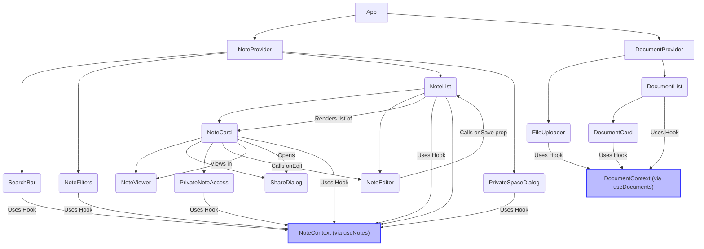

# Chapter 4: User Interface Components

Welcome back to the Quillon tutorial! In our journey so far, we've explored how Quillon manages all its dynamic information using React Contexts ([Chapter 1: State Management (React Contexts)](01_state_management__react_contexts__.md)) and the types of data it handles – Notes and Documents ([Chapter 2: Notes & Documents](02_notes___documents_.md)). We then learned how this data is saved and loaded so it persists even after you close the browser ([Chapter 3: Local Data Persistence](03_local_data_persistence_.md)).

Now, it's time to look at the part of the application you actually *see* and *interact with* – the **User Interface (UI) Components**. These are the visual building blocks that make up Quillon's interface.

### Building Blocks of the Interface

Imagine Quillon's screen as a collection of different interactive areas: a list of your notes, a place to type a new note, buttons to filter notes, a search bar, pop-up windows for actions like sharing or setting a private password, and so on.

Instead of building this entire complex screen as one massive piece, we break it down into smaller, independent, reusable parts. These are the **User Interface Components**.

Think of UI components like LEGO bricks. Each brick has a specific shape and purpose (a button brick, a text display brick, a card brick). You can combine these bricks in different ways to build larger structures (like a Note list or a File manager screen).

Using components offers several benefits:

*   **Organization:** It makes the code easier to understand and manage by breaking it into smaller, focused pieces.
*   **Reusability:** You can use the same component (like a button or a card) in multiple places throughout the application.
*   **Maintainability:** If there's a problem with one part (like how a note card looks), you only need to fix it in that specific `NoteCard` component, and the fix applies everywhere that component is used.
*   **Collaboration:** Different developers can work on different components simultaneously.

### How Quillon Builds Components: React and Tailwind CSS

Quillon uses two main technologies to build and style its UI components:

1.  **React:** This is a popular JavaScript library for building user interfaces. React lets us define components using a syntax called **JSX**, which looks a lot like HTML mixed with JavaScript. We define *what* the component should look like and *how* it should behave based on its data (props and state).
2.  **Tailwind CSS:** This is a "utility-first" CSS framework. Instead of writing custom CSS rules for each component, we apply pre-defined CSS classes directly to the HTML elements in our JSX. These classes handle styling like spacing (`p-4`), colors (`bg-blue-500`), layout (`flex`, `grid`), rounded corners (`rounded-lg`), etc. This helps maintain a consistent look and feel across the application and speeds up styling.

You'll find the component files primarily in the `src/components` folder.

### Connecting Components to Data: The Role of Contexts

In [Chapter 1](01_state_management__react_contexts__.md), we learned how Contexts (`NoteContext`, `DocumentContext`) hold the application's central state (the list of notes, search terms, etc.).

UI components are the **consumers** of this state and the **callers** of the functions provided by the Contexts.

A component that needs access to note data or needs to modify notes will use the `useNotes()` hook. Similarly, components dealing with documents will use `useDocuments()`.

Let's see this in action with a key component.

### Use Case: Displaying a Note as a Card

The `NoteCard` component is responsible for taking a single `Note` object and displaying a summarized version of it in the list.

You can find this component in `src/components/NoteCard.tsx`.

```typescript
// src/components/NoteCard.tsx (Simplified)
import React, { useState } from 'react';
import { Note } from '../types'; // Import the Note type
import { Pin, Star, Trash2, Edit } from 'lucide-react'; // Icons
import { useNotes } from '../context/NoteContext'; // Import the hook

interface NoteCardProps {
  note: Note; // Note data is passed as a prop
  onEdit: (note: Note) => void; // Function to call when editing
}

export function NoteCard({ note, onEdit }: NoteCardProps) {
  // We can get functions to update notes from the Context
  const { updateNote, deleteNote } = useNotes(); 

  // Access properties directly from the 'note' prop
  const { id, title, content, isFavorite, isPinned } = note;

  // ... other component state (like 'copied' state)

  return (
    <div className="p-5 rounded-xl shadow-md ..."> {/* Styled with Tailwind */}
      {/* Display title */}
      <h3 className="text-lg font-semibold text-gray-800 dark:text-white truncate">
        {title}
      </h3>

      {/* Display content snippet */}
      <p className="text-gray-600 dark:text-gray-200 text-sm line-clamp-4">
        {content}
      </p>

      {/* Buttons using Context functions and props */}
      <div className="flex gap-2 ml-2">
        <button onClick={() => updateNote(id, { isPinned: !isPinned })} className="p-1 ...">
          <Pin className={`h-4 w-4 ${isPinned ? 'fill-current' : ''}`} />
        </button>
        <button onClick={() => updateNote(id, { isFavorite: !isFavorite })} className="p-1 ...">
          <Star className={`h-4 w-4 ${isFavorite ? 'fill-current text-yellow-500' : ''}`} />
        </button>
        {/* Call parent's onEdit prop */}
        <button onClick={() => onEdit(note)} className="p-1 ...">
          <Edit className="h-4 w-4" />
        </button>
         {/* Call Context function to delete */}
        <button onClick={() => deleteNote(id)} className="p-1 ...">
          <Trash2 className="h-4 w-4" />
        </button>
      </div>
      {/* ... other elements */}
    </div>
  );
}
```

**Explanation:**

*   The `NoteCard` component is a function that receives `note` and `onEdit` as properties (props).
*   It uses the `useNotes()` hook to access functions like `updateNote` and `deleteNote` from the `NoteContext`.
*   Inside the `return` statement, JSX is used to define the structure of the card.
*   We use properties from the `note` prop (like `note.title`, `note.content`, `note.isPinned`) to display the information dynamically.
*   Tailwind CSS classes (like `p-5`, `rounded-xl`, `shadow-md`, `text-lg`, `font-semibold`) are added to the `className` prop of the HTML elements to style them.
*   Buttons have `onClick` handlers that call either the `onEdit` prop (passed from the parent component, likely triggering the `NoteEditor`) or the functions obtained from `useNotes()` (`updateNote`, `deleteNote`), passing the specific `note.id` to identify which note to modify in the central state.

This shows the typical pattern: components receive data (often via props or Context hooks), display it using JSX and Tailwind classes, and trigger actions by calling functions (passed as props or obtained from Context hooks).

### Use Case: Editing or Creating a Note

The `NoteEditor` component handles the form where you create a new note or modify an existing one.

You can find this in `src/components/NoteEditor.tsx`.

```typescript
// src/components/NoteEditor.tsx (Simplified)
import React, { useState } from 'react';
import { Note } from '../types';
import { X } from 'lucide-react';

interface NoteEditorProps {
  note?: Note; // Optional: Note to edit
  onSave: (note: Partial<Note>) => void; // Function to call on save
  onClose: () => void; // Function to call on close
}

export function NoteEditor({ note, onSave, onClose }: NoteEditorProps) {
  // Component state to manage form inputs
  const [title, setTitle] = useState(note?.title || '');
  const [content, setContent] = useState(note?.content || '');
  const [tags, setTags] = useState<string[]>(note?.tags || []);
  // ... other state variables like color, isPinned, etc.

  const handleSubmit = (e: React.FormEvent) => {
    e.preventDefault(); // Prevent page reload
    onSave({ // Call the onSave prop with the collected data
      title,
      content,
      tags,
      // ... include other state values
    });
  };

  // ... functions to handle tag input, color selection, etc.

  return (
    <div className="fixed inset-0 bg-black bg-opacity-50 flex items-center justify-center p-4 z-50 overflow-y-auto"> {/* Modal styling */}
      <div className="rounded-lg w-full max-w-2xl shadow-xl bg-white dark:bg-gray-800 ..."> {/* Editor container */}
        <form onSubmit={handleSubmit} className="p-6">
          <div className="flex justify-between items-center mb-4">
            <h2 className="text-xl font-bold ...">
              {note ? 'Edit Note' : 'New Note'}
            </h2>
            <button type="button" onClick={onClose} className="p-1 ...">
              <X className="h-5 w-5" />
            </button>
          </div>

          <div className="space-y-4">
            {/* Title Input */}
            <input
              type="text"
              value={title}
              onChange={(e) => setTitle(e.target.value)}
              placeholder="Note title"
              className="w-full p-3 border rounded-lg ..."
              required
            />

            {/* Content Textarea */}
            <textarea
              value={content}
              onChange={(e) => setContent(e.target.value)}
              placeholder="Note content"
              className="w-full p-3 border rounded-lg h-32 ..."
              required
            />

            {/* Tags Input and Display */}
            {/* ... Tag input field and rendered tags */}

            {/* Color and Flag Pickers (Pinned, Favorite, Private) */}
            {/* ... Buttons/checkboxes to set color, pinned, favorite, private state */}

          </div>

          {/* Save/Cancel Buttons */}
          <div className="flex justify-end gap-3 mt-6">
            <button type="button" onClick={onClose} className="px-4 py-2 ...">
              Cancel
            </button>
            <button type="submit" className="px-4 py-2 bg-blue-500 text-white rounded-lg ...">
              Save
            </button>
          </div>
        </form>
      </div>
    </div>
  );
}
```

**Explanation:**

*   The editor uses `useState` hooks (`setTitle`, `setContent`, `setTags`, etc.) to manage the current value of the input fields *within* this component. This is temporary state only needed while the user is editing.
*   When the user types, the `onChange` handlers update these local state variables.
*   When the form is submitted, the `handleSubmit` function is called. It collects the current values from the local state variables and calls the `onSave` prop, passing the data up to the parent component (which will then call a Context function like `addNote` or `updateNote`).
*   Tailwind classes are used extensively for layout, padding, borders, and colors.
*   The editor is often rendered conditionally (e.g., only when a "New Note" button is clicked or a `NoteCard` is clicked for editing) and styled to appear as a modal overlay.

This illustrates how components manage their own temporary state (for form inputs) and pass the final result up to a parent or directly call a Context function to update the global application state.

### Other Key UI Components

Quillon has many other UI components, each with a specific job:

*   **`SearchBar` (`src/components/SearchBar.tsx`):** Takes user text input. It gets the current `searchTerm` and the `setSearchTerm` function from `useNotes()` to read and update the global search state.
*   **`NoteFilters` (`src/components/NoteFilters.tsx`):** Displays available tags and filter options (like "Starred Only"). It gets the list of notes (to find all tags), the `selectedTags` array, and the `setSelectedTags` function (and similar state for other filters) from `useNotes()` to display the filters and update the selected ones in the global state.
*   **`NoteViewer` (`src/components/NoteViewer.tsx`):** Displays a note's full content in a read-only modal. It receives the `note` object as a prop and uses it to render the title, content, and metadata.
*   **Modal Dialogs:** Quillon uses several modal components that appear as pop-ups for specific tasks:
    *   `PrivateSpaceDialog` (`src/components/PrivateSpaceDialog.tsx`): Uses `useNotes()` to interact with the private space state (check if it exists, setup, unlock, delete). It has local state (`useState`) for the password inputs and error messages.
    *   `ShareDialog` (`src/components/ShareDialog.tsx`): Receives a `note` prop and provides options to share the note's content using browser features or links.
    *   `SharedNoteDialog` (`src/components/SharedNoteDialog.tsx`): (Note: This component appears in the snippets but represents a potential future sharing *management* feature beyond simple text sharing). It uses local state (`useState`) for managing shared users and activity history, and would likely interact with a backend system if sharing was fully implemented.
*   **Document Components:** Similar to notes, there are components for documents: `DocumentList` (`src/components/DocumentList.tsx`) and `DocumentCard` (`src/components/DocumentCard.tsx`). These interact with the `DocumentContext` using `useDocuments()`.
*   **File Uploader:** `FileUploader` (`src/components/FileUploader.tsx`) and `AttachmentManager` (`src/components/AttachmentManager.tsx`) handle file selection and display. They use `useDocuments()` (or manage local state for standalone attachments as seen in `AttachmentManager`) to add files and display upload status/errors.

Each of these components encapsulates the UI and logic for a specific part of the application, interacting with the global Contexts or receiving necessary data/functions via props.

### How Components Fit Together

The `App.tsx` file is where many of these top-level components are assembled. It wraps key parts of the application with the Context Providers ([Chapter 1](01_state_management__react_contexts__.md)) and then renders components like `NoteFilters`, `SearchBar`, and `NoteList`, often passing data or functions down as props or allowing them to access Context directly.

For example, `App.tsx` might render `NoteList`, and `NoteList` then maps over the `notes` array it gets from `useNotes()` to render a `NoteCard` for each note.


*Simplified Diagram: Shows how components are nested and interact with the Contexts.*

This diagram visualizes how `App` sets up the Contexts, and then various components are rendered. Components like `NoteList` get the list of notes from `NoteContext` and render individual `NoteCard`s. Components also trigger actions (like editing or deleting), often calling functions that update the state held in the Contexts.

### Styling with Tailwind CSS

As mentioned, styling in Quillon components is primarily done using Tailwind utility classes. You'll see many `className` props with multiple classes.

For example, a button might look like this:

```html
<button
  onClick={handleShare}
  className="mt-2 w-full bg-blue-500 text-white rounded-lg px-4 py-2 text-sm font-medium hover:bg-blue-600 transition-colors"
>
  Share
</button>
```

*   `mt-2`: Adds margin-top.
*   `w-full`: Makes the button take the full width.
*   `bg-blue-500`: Sets the background color to a shade of blue.
*   `text-white`: Sets the text color to white.
*   `rounded-lg`: Adds large rounded corners.
*   `px-4`: Adds horizontal padding.
*   `py-2`: Adds vertical padding.
*   `text-sm`: Sets the font size to small.
*   `font-medium`: Sets the font weight.
*   `hover:bg-blue-600`: Changes the background color on hover.
*   `transition-colors`: Animates color changes smoothly.

This approach keeps the styling directly alongside the JSX structure, making it clear how each element is styled. Tailwind handles generating the actual CSS rules based on these classes.

### Conclusion

User Interface Components are the visible, interactive parts of Quillon. They are built using React for structure and behavior, and styled using Tailwind CSS for appearance. Components are designed to be modular and reusable, and they interact with the application's central state by using hooks like `useNotes()` and `useDocuments()` from the Contexts we discussed earlier. They either display data obtained from the Contexts or call functions provided by the Contexts to update the state based on user actions.

Understanding how components are structured, how they get data from Contexts, and how they use Tailwind for styling is fundamental to seeing how Quillon's interface works.

Now that we know how the interface is built, let's dive into a key feature that combines UI components with our data and state management: filtering and searching your notes!

[Next Chapter: Note Filtering and Search](05_note_filtering_and_search_.md)
