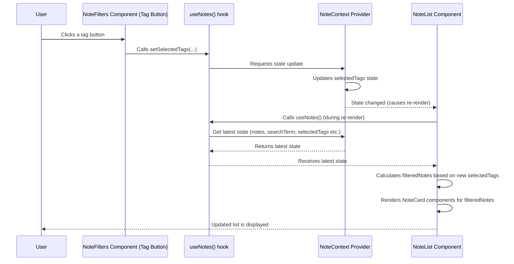

# Chapter 5: Note Filtering and Search

Welcome back! In our previous chapters, we've learned how Quillon manages its central data using Contexts ([Chapter 1: State Management (React Contexts)](01_state_management__react_contexts__.md)), what that data looks like (Notes and Documents, [Chapter 2: Notes & Documents](02_notes___documents_.md)), how it's saved locally ([Chapter 3: Local Data Persistence](03_local_data_persistence_.md)), and how the visual parts of the application (UI Components, [Chapter 4: User Interface Components](04_user_interface_components_.md)) are built and interact with that data.

Now, let's tackle a common problem: as your collection of notes grows, how do you quickly find the specific one you're looking for? Scrolling through potentially hundreds of notes would be slow and frustrating!

This is where the **Note Filtering and Search** features come in. They are the tools that help you narrow down your note list to display only the notes that match certain criteria.

### Finding Your Notes: Search and Filters

Imagine you have a huge pile of note cards. If you need a specific one, you wouldn't just flip through them all randomly. You'd look for clues: maybe you remember a keyword, or the card had a specific tag you used, or maybe it was one you marked as important.

Quillon provides digital tools that work the same way:

1.  **Searching:** You type keywords into a search bar, and Quillon shows you notes that contain those words in their title, content, or tags.
2.  **Filtering:** You click on specific tags you've added to your notes, and Quillon only shows you the notes that have *all* those selected tags. You can also filter by special statuses like "starred" or notes in the "trash".

This abstraction combines the UI components that let you input your criteria with the underlying logic that compares your criteria against all your notes and decides which ones to show.

### Where the Criteria Live: The NoteContext Whiteboard

Just like the list of notes itself, the criteria you use for filtering and searching need a central place to be stored so that all relevant parts of the application can access them. This place is our familiar `NoteContext` whiteboard.

Remember the `useNotes()` hook from [Chapter 1](01_state_management__react_contexts__.md)? Besides giving us the `notes` array, it also gives us access to the current search term and the list of selected tags.

```typescript
// Simplified snippet from a component using filtering/search
import { useNotes } from '../context/NoteContext';

function MyComponent() {
  // Get the notes and the criteria for finding them
  const {
    notes, // The full list of all notes
    searchTerm, // The text currently in the search bar
    selectedTags, // The list of tags the user has clicked
    showStarredOnly, // True/false for the starred filter
    showPrivateNotes, // True/false for the private filter
    showTrash, // True/false for the trash filter
    // ... and the functions to change these criteria
    setSearchTerm,
    setSelectedTags,
    setShowStarredOnly,
    setShowPrivateNotes,
    setShowTrash,
    // ... other stuff from useNotes()
  } = useNotes();

  // ... component logic using these values
}
```

**Explanation:**

*   The `NoteContext` stores the user's *intent* for finding notes: `searchTerm`, `selectedTags`, `showStarredOnly`, etc.
*   UI components that allow the user to *change* these criteria (like the Search Bar and Filter buttons) get the `setSearchTerm`, `setSelectedTags`, etc., functions from `useNotes()` and call them when the user interacts.
*   The component that *displays* the list of notes (the `NoteList` component in `App.tsx`) gets the `notes` array *and* the `searchTerm`, `selectedTags`, etc., from `useNotes()`. It then uses all this information together to figure out which notes to display.

### The UI for Finding: SearchBar and NoteFilters

Let's look briefly at the two main UI components where the user sets their filtering and search criteria. Both are in the `src/components` folder.

1.  **`SearchBar.tsx`:** This component provides the text input field.

    ```typescript
    // src/components/SearchBar.tsx (Simplified)
    import { Search } from 'lucide-react';
    import { useNotes } from '../context/NoteContext'; // Access state and setters

    export function SearchBar() {
      const { searchTerm, setSearchTerm } = useNotes(); // Get state and setter

      return (
        <div className="..."> {/* Tailwind classes for styling */}
          <Search className="..." /> {/* Icon */}
          <input
            type="text"
            value={searchTerm} // Display the current search term
            onChange={(e) => setSearchTerm(e.target.value)} // Update state when user types
            placeholder="Search notes..."
            className="..." // Tailwind classes
          />
        </div>
      );
    }
    ```

    **Explanation:**
    *   It uses `useNotes()` to get the current `searchTerm` state and the `setSearchTerm` function.
    *   The `value` prop of the `input` is set to the `searchTerm` from the Context, so the input always shows the current search state.
    *   The `onChange` handler calls `setSearchTerm` with the new value from the input field every time the user types. This updates the `searchTerm` state in the `NoteContext`, which automatically signals to other components (like `NoteList`) that something has changed.

2.  **`NoteFilters.tsx`:** This component displays clickable tags and filter buttons (like "Starred").

    ```typescript
    // src/components/NoteFilters.tsx (Simplified)
    import { Star } from 'lucide-react';
    import { useNotes } from '../context/NoteContext'; // Access state and setters

    export function NoteFilters() {
      const {
        notes, // Need notes to get available tags
        selectedTags, // Current selected tags
        setSelectedTags, // Function to update selected tags
        showStarredOnly, // Current starred filter state
        setShowStarredOnly // Function to update starred filter
      } = useNotes();

      // Logic to extract unique tags from all notes
      const allTags = Array.from(new Set(notes.flatMap(note => note.tags)));

      return (
        <div className="..."> {/* Container */}
          {/* Starred Filter Button */}
          <button
            onClick={() => setShowStarredOnly(!showStarredOnly)} // Toggle state
            className={`... ${showStarredOnly ? 'bg-yellow-500' : '...'}`} // Styling based on state
          >
            <Star className="..." /> {/* Icon */}
            Starred
          </button>

          {/* Tag Buttons */}
          <div className="flex flex-wrap gap-2">
            {allTags.map(tag => (
              <button
                key={tag}
                onClick={() => {
                  // Toggle tag selection in selectedTags array
                  setSelectedTags(
                    selectedTags.includes(tag)
                      ? selectedTags.filter(t => t !== tag) // Remove tag
                      : [...selectedTags, tag] // Add tag
                  );
                }}
                className={`... ${selectedTags.includes(tag) ? 'bg-blue-500' : '...'}`} // Styling based on selection
              >
                {tag}
              </button>
            ))}
          </div>
        </div>
      );
    }
    ```

    **Explanation:**
    *   `NoteFilters` also uses `useNotes()` to get the relevant state variables (`notes`, `selectedTags`, `showStarredOnly`) and their setters (`setSelectedTags`, `setShowStarredOnly`).
    *   It looks at the `notes` array to figure out *which* tags exist across all notes so it can display buttons for them.
    *   Clicking the "Starred" button calls `setShowStarredOnly`, toggling the boolean state in `NoteContext`.
    *   Clicking a tag button checks if the tag is already in the `selectedTags` array. If yes, it removes it; if no, it adds it. It then calls `setSelectedTags` with the updated array, changing the state in `NoteContext`.

In both cases, the UI components don't do the filtering themselves. They just provide the interface for the user to *define* the criteria and then update the central state (`searchTerm`, `selectedTags`, etc.) in the `NoteContext`.

### The Filtering Logic: The NoteList's Job

Now that the user's filtering and search criteria are stored centrally in the `NoteContext`, the component responsible for displaying the list – the `NoteList` component (which is part of `App.tsx`) – needs to use this information.

The `NoteList` gets *all* the notes from `useNotes()`, but it doesn't just display them directly. It applies the filtering and search criteria *before* rendering the `NoteCard` components.

This happens using the standard JavaScript `filter()` method on the array of notes.

Here's a simplified look at the `filteredNotes` calculation within the `NoteList` component in `App.tsx`:

```typescript
// src/App.tsx (Simplified NoteList component snippet)
function NoteList() {
  const {
    notes, // The full list of notes from context
    searchTerm, // Search term from context
    selectedTags, // Selected tags from context
    showStarredOnly, // Starred filter from context
    showPrivateNotes, // Private filter from context
    showTrash, // Trash filter from context
    // ... setters and other state
  } = useNotes();

  const filteredNotes = notes.filter(note => {
    // 1. Filter by Trash status
    if (showTrash !== !!note.isDeleted) {
      return false; // If we're showing trash, hide non-deleted. If hiding trash, hide deleted.
    }

    // 2. Filter by Private status (only applies if Private Space is unlocked)
    if (note.isPrivate !== showPrivateNotes) {
       // If note is private, only show it if showPrivateNotes is true
       // If note is NOT private, only show it if showPrivateNotes is false
       return false;
    }

    // 3. Filter by Starred status
    if (showStarredOnly && !note.isFavorite) {
      return false; // If "Show Starred Only" is true, hide notes that are NOT starred
    }

    // 4. Filter by Search Term
    const lowerSearchTerm = searchTerm.toLowerCase();
    const matchesSearch =
      note.title.toLowerCase().includes(lowerSearchTerm) ||
      note.content.toLowerCase().includes(lowerSearchTerm) ||
      note.tags.some(tag => tag.toLowerCase().includes(lowerSearchTerm));
    if (searchTerm && !matchesSearch) {
      return false; // If there's a search term and the note doesn't match, hide it
    }

    // 5. Filter by Selected Tags
    // This is a bit more complex due to file tags, but simplified logic is:
    // If any normal tags are selected, the note MUST include ALL of them.
    // If a file tag is selected, only show notes with *that specific* file tag.
    // (See full App.tsx code for exact logic)
    const normalTags = selectedTags.filter(tag => !isFileTag(tag)); // Assuming isFileTag is available

    const matchesNormalTags =
      normalTags.length === 0 || // If no normal tags selected, this filter passes
      normalTags.every(tag => note.tags.includes(tag)); // If tags selected, note must have ALL

    // Simplified file tag logic:
    const selectedFileTag = selectedTags.find(tag => isFileTag(tag));
    const noteHasFileTag = note.tags.some(tag => isFileTag(tag));

    if (selectedFileTag) {
      // If a file tag is selected, a note is shown ONLY if it has that specific file tag
      return note.tags.includes(selectedFileTag) && matchesNormalTags && matchesSearch;
    } else if (noteHasFileTag) {
        // If NO file tag is selected, but the note *has* a file tag, hide it
        return false;
    }

    // If no file tag selected and note has no file tag, apply normal tag/search filters
    return matchesNormalTags && matchesSearch;

  }); // The filter function returns true to keep the note, false to hide it

  // Notes are then sorted (logic omitted for simplicity)
  const sortedFilteredNotes = filteredNotes.sort(/* ... sorting logic ... */);


  return (
    <div className="...">
      {/* Render SearchBar and NoteFilters */}
      {!showTrash && <NoteFilters />}

      {/* Render the filtered and sorted notes */}
      <div className="...">
        {sortedFilteredNotes.map(note => (
          <NoteCard key={note.id} note={note} onEdit={handleEdit} />
        ))}
      </div>
      {/* ... rest of NoteList */}
    </div>
  );
}
```

**Explanation:**

*   The `filteredNotes` variable is calculated by calling `.filter()` on the original `notes` array.
*   The function inside `filter` is executed for *each* note. It's a series of `if` checks based on the values of `showTrash`, `showPrivateNotes`, `showStarredOnly`, `searchTerm`, and `selectedTags` (all obtained from `useNotes()`).
*   If a note *fails* any of the checks (`if (...) return false;`), it is excluded from the `filteredNotes` array.
*   If a note passes *all* the checks, the filter function implicitly returns `true`, and the note is included.
*   The complex tag logic handles the distinction between regular user-defined tags and the special tags used internally for "file folders" (notes linked to documents).
*   Finally, the `NoteList` component maps over the resulting `filteredNotes` array to render only the `NoteCard` components for the notes that passed the filters.

Because `searchTerm`, `selectedTags`, `showStarredOnly`, etc., are state variables from the `NoteContext`, whenever `setSearchTerm`, `setSelectedTags`, etc., are called (by the `SearchBar` or `NoteFilters`), the `NoteContext` state updates. This causes the `NoteList` component (which uses `useNotes()`) to re-render. During the re-render, the `filteredNotes` calculation runs again with the *new* criteria, resulting in the updated list of notes being displayed.

### Sequence Diagram: Applying a Filter

Let's see how clicking a tag button updates the visible list of notes.



This diagram shows how user interaction with the `NoteFilters` component updates the central `selectedTags` state in `NoteContext`. Because `NoteList` depends on this state (via `useNotes()`), it automatically re-renders, re-calculates the `filteredNotes` array using the new criteria, and displays the updated list. The search bar works similarly, updating the `searchTerm` state.

### Search vs. Filter

Here's a quick comparison of the two main ways to find notes:

| Feature         | Search                     | Filtering (Tags & Flags)           |
| :-------------- | :------------------------- | :--------------------------------- |
| **Input Method**| Text entered in a bar      | Clicking buttons/options           |
| **Criteria**    | Keywords (in title, content, tags) | Specific tags, Starred status, Private status, Trash status |
| **Combination** | Applied *in addition* to filters | Applied *in addition* to search and other filters |
| **UI Component**| `SearchBar`                | `NoteFilters` (and buttons in `NoteList` for Trash/Private) |

They work together: you can type a search term *and* select tags *and* show only starred items simultaneously. The filtering logic in `NoteList` checks *all* these criteria to determine which notes to display.

### Conclusion

Filtering and search are essential features for managing a growing collection of notes. In Quillon, these features are built by:

1.  Using UI components (`SearchBar`, `NoteFilters`) to capture the user's criteria.
2.  Storing these criteria (`searchTerm`, `selectedTags`, `showStarredOnly`, `showPrivateNotes`, `showTrash`) as state variables in the central `NoteContext`.
3.  Using the `NoteList` component in `App.tsx` to access these state variables via `useNotes()` and apply a filtering logic (using JavaScript's `.filter()` method) to the full list of notes before displaying them.

This separation of concerns – UI for input, Context for state, and `NoteList` logic for application – makes the feature maintainable and ensures that updating a filter instantly updates the displayed list.

You now understand how Quillon helps you navigate your notes. Next, we'll look at a specific feature that builds upon our state management and UI components: the Private Space.

[Next Chapter: Private Space Feature](06_private_space_feature_.md)
