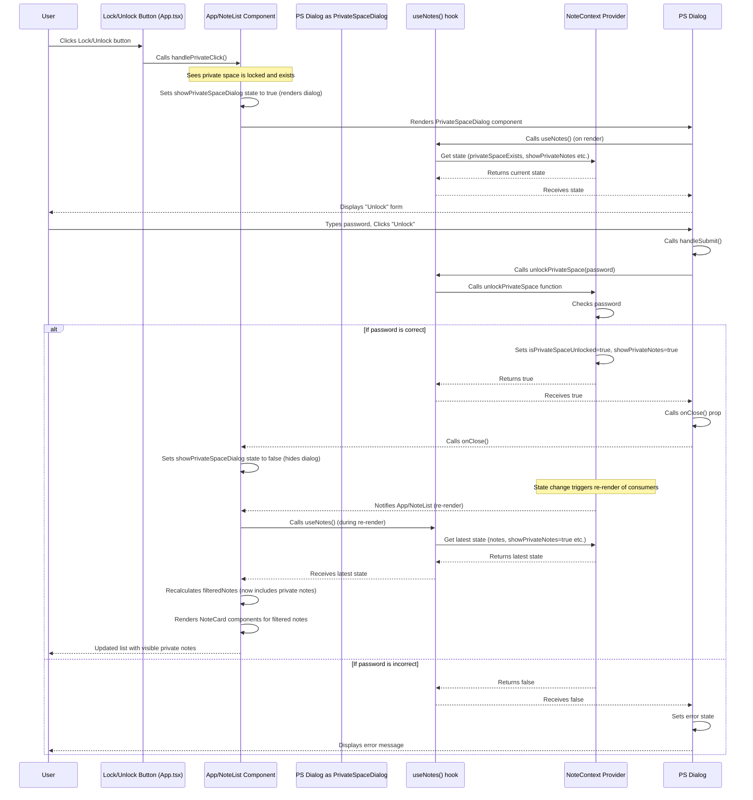

# Chapter 6: Private Space Feature

Welcome back to the Quillon tutorial! We've covered a lot of ground: managing application state with Contexts ([Chapter 1: State Management (React Contexts)](01_state_management__react_contexts__.md)), understanding the core data (Notes and Documents, [Chapter 2: Notes & Documents](02_notes___documents_.md)), saving that data locally ([Chapter 3: Local Data Persistence](03_local_data_persistence_.md)), building the visual interface with components ([Chapter 4: User Interface Components](04_user_interface_components_.md)), and organizing your notes using filtering and search ([Chapter 5: Note Filtering and Search](05_note_filtering_and_search_.md)).

Now, let's look at a feature designed for those times when you have sensitive information that you don't want everyone to see easily: the **Private Space Feature**.

### Keeping Things Secret: The Need for Privacy

Imagine you're using Quillon to jot down ideas, thoughts, or perhaps even some personal details like journal entries. Most of your notes are fine to be visible, but you might have a few that contain information you'd prefer to keep private, hidden away from casual browsing.

If someone happens to look at your screen, or if you quickly need to hide certain notes, you need a way to make them disappear from the main list and only show up when explicitly unlocked.

The **Private Space Feature** in Quillon provides a basic layer of privacy for these sensitive notes. It allows you to designate specific notes as "private" and hide them behind a password.

### The Private Space: A Password-Protected Vault

Think of the Private Space as a digital vault within Quillon. You set a password for this vault.

*   Notes marked as "private" are locked away inside this vault.
*   Their content is hidden in the main note list.
*   They only become visible and readable when you "unlock" the private space by entering the correct password.

This feature combines state management (to track the password and the unlocked status), UI components (for setting up and unlocking), and the filtering logic (to hide/show private notes).

### How It Works: State in the NoteContext

The central control for the Private Space feature lives, like most note-related state, within the `NoteContext`.

Here are the key pieces of state managed by `NoteContext` specifically for the private space:

*   **`privateSpacePassword`:** This holds the password string you set for the private space. This password is saved locally using `localStorage` ([Chapter 3](03_local_data_persistence_.md)) so it persists between sessions.
*   **`privateSpaceExists`:** A simple boolean derived from whether `privateSpacePassword` has a value. It tells the application if a private space has been set up at all.
*   **`isPrivateSpaceUnlocked`:** A boolean that is `true` only after the user successfully enters the correct password *during the current session*. It's `false` by default when the app starts or after explicitly locking the space.
*   **`showPrivateNotes`:** A boolean flag that controls whether the `NoteList` should include private notes in its display. This is automatically set to `true` when the space is unlocked and `false` when locked.

The `NoteContext` also provides functions to interact with this state:

*   `setupPrivateSpace(password)`: Called when you set the password for the first time.
*   `unlockPrivateSpace(password)`: Called when you try to open the vault. Checks the entered password against the stored one and updates `isPrivateSpaceUnlocked` and `showPrivateNotes`.
*   `lockPrivateSpace()`: Called to close the vault and hide private notes. Resets `isPrivateSpaceUnlocked` and `showPrivateNotes` to `false`.
*   `deletePrivateSpace()`: Removes the password and permanently deletes *all* notes previously marked as private.

Components that need to know the status of the private space or trigger setup/unlock actions will use the `useNotes()` hook to access these state variables and functions.

```typescript
// src/context/NoteContext.tsx (Simplified)
// ... imports and other state ...

function NoteProvider({ children }) {
  // State for the private space
  const [privateSpacePassword, setPrivateSpacePassword] = useState<string>(() => {
    const saved = localStorage.getItem('privateSpacePassword');
    return saved || ''; // Load password from localStorage on startup
  });
  const [isPrivateSpaceUnlocked, setIsPrivateSpaceUnlocked] = useState(false);
  const [showPrivateNotes, setShowPrivateNotes] = useState(false);

  // derived state
  const privateSpaceExists = !!privateSpacePassword; // True if password is set

  // Effect to save password to localStorage whenever it changes
  useEffect(() => {
    localStorage.setItem('privateSpacePassword', privateSpacePassword);
  }, [privateSpacePassword]);

  // ... other effects and functions (addNote, updateNote, etc.)

  // Private Space functions
  const setupPrivateSpace = (password: string) => {
    setPrivateSpacePassword(password);
    setIsPrivateSpaceUnlocked(true); // Unlock immediately after setup
    setShowPrivateNotes(true);
  };

  const unlockPrivateSpace = (password: string): boolean => {
    if (password === privateSpacePassword) {
      setIsPrivateSpaceUnlocked(true);
      setShowPrivateNotes(true); // Show private notes after successful unlock
      return true;
    }
    return false; // Password incorrect
  };

  const lockPrivateSpace = () => {
    setIsPrivateSpaceUnlocked(false);
    setShowPrivateNotes(false); // Hide private notes when locked
  };

  const deletePrivateSpace = () => {
    // Filter out private notes permanently!
    setNotes(prev => prev.filter(note => !note.isPrivate)); 
    setPrivateSpacePassword(''); // Remove password
    setIsPrivateSpaceUnlocked(false);
    setShowPrivateNotes(false);
  };

  // The value object available to consumers
  return (
    <NoteContext.Provider value={{
      // ... other state and functions
      privateSpaceExists,
      isPrivateSpaceUnlocked,
      showPrivateNotes,
      setupPrivateSpace,
      unlockPrivateSpace,
      lockPrivateSpace,
      deletePrivateSpace,
    }}>
      {children}
    </NoteContext.Provider>
  );
}

// ... useNotes hook
```

**Explanation:**

*   The `useState` hooks initialize the private space state variables, loading the password from `localStorage` on startup.
*   A `useEffect` ensures that any change to `privateSpacePassword` is immediately saved to `localStorage`.
*   The functions `setupPrivateSpace`, `unlockPrivateSpace`, `lockPrivateSpace`, and `deletePrivateSpace` modify these state variables based on user actions and password checks. Crucially, `unlockPrivateSpace` and `lockPrivateSpace` update `showPrivateNotes`, the flag that dictates UI visibility.

**Important Security Note:** Storing the password directly in `localStorage` is *not* a secure method for highly sensitive data, as `localStorage` is not encrypted and can be accessed by other scripts running on the same domain. For this beginner tutorial and basic local privacy, it suffices, but in a real-world high-security application, you would use much stronger encryption and storage methods. This feature provides a deterrent against casual snooping, not protection against sophisticated attackers.

### The User Interface: PrivateSpaceDialog

The main component the user interacts with to manage the private space is the `PrivateSpaceDialog` (`src/components/PrivateSpaceDialog.tsx`). This component appears as a modal (a pop-up overlay) and handles setting, unlocking, or deleting the private space.

```typescript
// src/components/PrivateSpaceDialog.tsx (Simplified)
import React, { useState } from 'react';
import { useNotes } from '../context/NoteContext'; // Get private space logic

interface PrivateSpaceDialogProps {
  onClose: () => void; // Function to close the dialog
}

export function PrivateSpaceDialog({ onClose }: PrivateSpaceDialogProps) {
  // Get state and functions from NoteContext
  const {
    privateSpaceExists,
    setupPrivateSpace,
    unlockPrivateSpace,
    deletePrivateSpace,
    showPrivateNotes // Needed for styling indication
  } = useNotes();

  // Local component state for form inputs and errors
  const [password, setPassword] = useState('');
  const [confirmPassword, setConfirmPassword] = useState('');
  const [error, setError] = useState('');
  const [showDeleteConfirm, setShowDeleteConfirm] = useState(false); // For delete confirmation step

  const handleSubmit = (e: React.FormEvent) => {
    e.preventDefault();
    setError(''); // Clear previous errors

    if (privateSpaceExists) {
      // If space exists, try to unlock
      if (unlockPrivateSpace(password)) {
        onClose(); // Close dialog on success
      } else {
        setError('Incorrect password'); // Show error on failure
        setPassword(''); // Clear password field
      }
    } else {
      // If space doesn't exist, try to set up
      if (password.length < 6) { // Basic password length check
        setError('Password must be at least 6 characters');
        return;
      }
      if (password !== confirmPassword) { // Check passwords match
        setError('Passwords do not match');
        return;
      }
      setupPrivateSpace(password); // Call context function to setup
      onClose(); // Close dialog on success
    }
  };

  const handleDelete = () => {
    deletePrivateSpace(); // Call context function to delete
    setShowDeleteConfirm(false); // Hide confirmation
    onClose(); // Close main dialog
  };

  // ... conditional rendering for delete confirmation ...

  return (
    <div className="fixed inset-0 bg-black bg-opacity-50 flex items-center justify-center p-4 z-50">
      {/* Modal container styled with Tailwind */}
      <div className="bg-white dark:bg-gray-800 rounded-lg w-full max-w-md shadow-xl">
        <div className="p-6">
          {/* Header */}
          <div className="flex justify-between items-center mb-6">
             {/* Icon and Title */}
            <div className="flex items-center gap-2">
              <Lock className="..." />
              <h2 className="...">
                {privateSpaceExists ? 'Unlock Private Space' : 'Create Private Space'}
              </h2>
            </div>
            {/* Close button */}
            <button onClick={onClose} className="..."> <X className="..." /> </button>
          </div>

          {/* Form */}
          <form onSubmit={handleSubmit} className="space-y-4">
            {/* Password Input */}
            <div>
              <label className="..."> {privateSpaceExists ? 'Enter Password' : 'Set Password'} </label>
              <input
                type="password"
                value={password}
                onChange={(e) => setPassword(e.target.value)} // Update local state
                className="..."
                required
              />
            </div>

            {/* Confirm Password Input (only for setup) */}
            {!privateSpaceExists && (
              <div>
                 <label className="..."> Confirm Password </label>
                 <input type="password" value={confirmPassword} onChange={(e) => setConfirmPassword(e.target.value)} className="..." required />
              </div>
            )}

            {/* Error Message */}
            {error && (<p className="text-sm text-red-500">{error}</p>)}

            {/* Buttons */}
            <div className="flex justify-between items-center pt-2">
              {privateSpaceExists && (
                // Delete button (only if space exists)
                <button type="button" onClick={() => setShowDeleteConfirm(true)} className="...">
                  Delete Private Space
                </button>
              )}
              <div className="flex gap-3 ml-auto">
                <button type="button" onClick={onClose} className="..."> Cancel </button>
                <button type="submit" className="..."> {privateSpaceExists ? 'Unlock' : 'Create'} </button>
              </div>
            </div>
          </form>
        </div>
      </div>
    </div>
  );
}
```

**Explanation:**

*   The component uses `useState` hooks to manage the input values (`password`, `confirmPassword`) and the error message (`error`) *within* the dialog itself. This is temporary UI state ([Chapter 4](04_user_interface_components_.md)).
*   It uses `useNotes()` to get the `privateSpaceExists` flag (to determine if it should show the "Create" or "Unlock" view) and the `setupPrivateSpace`, `unlockPrivateSpace`, and `deletePrivateSpace` functions.
*   The `handleSubmit` function reads the local password state, performs basic validation (match check for setup, length check), and then calls the appropriate Context function (`setupPrivateSpace` or `unlockPrivateSpace`).
*   Success in `unlockPrivateSpace` or completion of `setupPrivateSpace` causes the dialog to call its `onClose` prop, which hides the modal in the parent component (`App.tsx`).
*   The "Delete Private Space" functionality is handled by showing a confirmation state (`showDeleteConfirm`) before calling `deletePrivateSpace` from the context.
*   Tailwind CSS is used for the styling of the modal overlay and its content.

### Hiding and Showing Notes: The Filtering Logic

This is where the Private Space feature integrates with the note filtering we learned about in [Chapter 5](05_note_filtering_and_search_.md).

The `NoteList` component in `App.tsx` (which displays the notes) uses the `showPrivateNotes` state from `NoteContext` to decide whether to include or exclude notes that are marked as private (`note.isPrivate === true`).

The `filteredNotes` calculation inside the `NoteList` component checks the `showPrivateNotes` flag:

```typescript
// src/App.tsx (Simplified NoteList component snippet)
function NoteList() {
  const {
    notes,
    // ... other filters like searchTerm, selectedTags, showStarredOnly, showTrash
    showPrivateNotes, // Get the state from context
    // ... setters and other state
  } = useNotes();

  const filteredNotes = notes.filter(note => {
    // ... other filter checks (Trash, Starred, Search, Tags)

    // Private note filtering check
    // If showPrivateNotes is FALSE, this condition means "if note.isPrivate is TRUE, return false"
    // If showPrivateNotes is TRUE, this condition means "if note.isPrivate is FALSE, return false"
    // This check is equivalent to: only show the note if (note.isPrivate === showPrivateNotes)
    // For the main view (showTrash === false):
    //  - if showPrivateNotes is false, we hide private notes (note.isPrivate === true)
    //  - if showPrivateNotes is true, we show private notes (note.isPrivate === true) AND non-private notes (note.isPrivate === false)
    // The full logic in App.tsx is slightly more nuanced to handle showTrash correctly
    // But the core private check is: If we are NOT showing private notes (showPrivateNotes is false)
    // AND this note IS private (note.isPrivate is true), then hide it.
    // If we ARE showing private notes (showPrivateNotes is true), OR this note is NOT private, proceed.

    if (!showPrivateNotes && note.isPrivate) {
       return false; // Hide private notes if private space is NOT unlocked/shown
    }

    // ... rest of filtering logic ...

    return true; // Keep the note if all checks pass
  });

  // ... sorting and rendering filteredNotes ...
}
```

**Explanation:**

*   The `NoteList` gets the current value of `showPrivateNotes` from `useNotes()`.
*   Inside the `.filter()` method, there's a check: `if (!showPrivateNotes && note.isPrivate)`.
*   If `showPrivateNotes` is `false` (the default when locked), this condition is `true` for any note where `note.isPrivate` is `true`, causing `.filter` to return `false` for that note and hide it from the list.
*   If `showPrivateNotes` is `true` (after unlocking), the `!showPrivateNotes` part of the condition is `false`, so the whole `if` block is skipped, and private notes are *not* filtered out based on their private status at this step (they might still be filtered by search, tags, etc.).

The state change (`setShowPrivateNotes`) in the `NoteContext` (triggered by `unlockPrivateSpace` or `lockPrivateSpace`) causes the `NoteList` component to re-render. During the re-render, the `filteredNotes` calculation runs again with the updated `showPrivateNotes` value, instantly showing or hiding the private notes in the list.

### Visual Indication: The Note Card

Even when a private note's content is hidden, the `NoteCard` component (`src/components/NoteCard.tsx`) needs to indicate that it's a private note and handle showing/hiding the content.

```typescript
// src/components/NoteCard.tsx (Simplified)
import { useNotes } from '../context/NoteContext'; // Get state

interface NoteCardProps {
  note: Note; // The note object, including isPrivate
  // ... other props
}

export function NoteCard({ note, onEdit }: NoteCardProps) {
  const { showPrivateNotes } = useNotes(); // Get state

  // Determine if content should be visible
  const isContentVisible = !note.isPrivate || showPrivateNotes;

  return (
    <div className="..."> {/* Card container */}
      {/* ... Title and status icons (Pin, Star) ... */}

      <div className="..."> {/* Content area */}
        {isContentVisible ? (
          // Show actual content if visible
          <p className="..."> {note.content} </p>
        ) : (
          // Show placeholder if hidden
          <div className="flex items-center justify-center h-full text-gray-500">
            <Lock className="h-5 w-5 mr-2" />
            <span>Private note content</span>
          </div>
        )}
      </div>

      {/* ... Tags, Date, Action buttons (Edit, Copy, Download, etc.) ... */}
      {/* Some actions like Copy/Download are also conditional on isContentVisible */}
      {/* The Lock icon is displayed next to the title if note.isPrivate is true */}
      {note.isPrivate && (
        <Lock className="h-4 w-4 shrink-0 text-purple-500 dark:text-purple-400" />
      )}
       {/* Action buttons check showPrivateNotes before rendering */}
       {!showTrash && isContentVisible && (
         // Render Copy, Download, View buttons only if content is visible
         // ... Copy button onClick={handleCopy} checks isContentVisible internally ...
       )}
       {/* Edit button */}
       {!showTrash && ( // Edit button should always be visible if note is not in trash
         // ... Edit button ...
         // Note: Clicking Edit on a private note when locked will open the editor,
         // but the editor itself might also need logic to hide content or require unlock.
         // In Quillon, accessing private notes when locked typically routes through NoteViewer
         // which might trigger PrivateNoteAccess dialog (not covered here as it's similar logic).
       )}

    </div>
  );
}
```

**Explanation:**

*   The `NoteCard` component uses the `showPrivateNotes` state from `useNotes()` and the `isPrivate` property from the `note` prop.
*   It calculates `isContentVisible` based on whether the note is private and if the private space is unlocked.
*   It conditionally renders either the note's actual `content` or a "Private note content" placeholder based on `isContentVisible`.
*   The `Lock` icon is always shown next to the title if `note.isPrivate` is true, indicating its status regardless of whether it's currently unlocked.
*   Action buttons like "Copy", "Download", and "View" are also hidden unless `isContentVisible` is true, preventing access to sensitive data via those routes when the space is locked. The "Edit" button remains visible to allow toggling the `isPrivate` flag itself even when locked, but accessing the *content* for editing requires unlocking or a separate note password check (as seen in `PrivateNoteAccess.tsx`, which handles per-note password checks, though the main private space covers *all* private notes).

### User Flow Walkthrough (Unlocking)

1.  **Initial State:** When Quillon loads, `isPrivateSpaceUnlocked` and `showPrivateNotes` are `false`. The `NoteList` filters out all notes where `note.isPrivate` is true. `NoteCard` components for private notes show the placeholder.
2.  **User Wants Access:** The user clicks the "Lock" icon button (often in the main header near other controls like the Trash button, as seen in `App.tsx`).
3.  **Open Dialog:** The `handlePrivateClick` function in `App.tsx` sees that `showPrivateNotes` is false and `privateSpaceExists` is true. It sets local state (`setShowPrivateSpaceDialog(true)`), causing the `PrivateSpaceDialog` component to render.
4.  **Dialog Appears:** The `PrivateSpaceDialog` fetches `privateSpaceExists` (`true`) and `showPrivateNotes` (`false`) from `useNotes()`. It renders the "Unlock Private Space" view with a password input.
5.  **User Enters Password:** The user types their password. The input's `onChange` handler updates the local `password` state in the `PrivateSpaceDialog`.
6.  **User Submits:** The user clicks "Unlock" (or presses Enter). The `handleSubmit` function in `PrivateSpaceDialog` is called.
7.  **Attempt Unlock:** `handleSubmit` calls `unlockPrivateSpace(password)` from `useNotes()`.
8.  **Context Checks Password:** The `unlockPrivateSpace` function in `NoteContext` compares the provided `password` with the stored `privateSpacePassword`.
9.  **Password Correct:** If they match, `unlockPrivateSpace` sets `isPrivateSpaceUnlocked` to `true` and `showPrivateNotes` to `true` using their respective setters. It returns `true`.
10. **Dialog Success:** Back in `PrivateSpaceDialog`, `handleSubmit` receives `true` from `unlockPrivateSpace`. It calls its `onClose` prop, hiding the dialog.
11. **NoteList Re-renders:** The state changes (`showPrivateNotes` is now `true`) in `NoteContext` trigger a re-render of components that use `useNotes()`, including `NoteList`.
12. **Filtering Updates:** During re-render, `NoteList` gets the new `showPrivateNotes` value (`true`). The filtering logic `if (!showPrivateNotes && note.isPrivate)` now evaluates to `if (false && note.isPrivate)` which is always `false`, so private notes are *no longer filtered out* by this condition.
13. **Note Cards Update:** The `NoteList` maps over the newly filtered list (which now includes private notes). Each `NoteCard` for a private note gets the updated `showPrivateNotes` (`true`) via `useNotes()`. The `isContentVisible` calculation (`!note.isPrivate || showPrivateNotes`) for these notes becomes `!true || true`, which is `false || true`, evaluating to `true`.
14. **Content Appears:** The `NoteCard` component now renders the actual `note.content` because `isContentVisible` is true. The user sees their private notes and their content.

Locking follows a similar flow, triggered by the same button when the space is already unlocked, calling `lockPrivateSpace` to set `showPrivateNotes` back to `false`, causing the list and cards to update and hide the content again.

Here's a sequence diagram for the unlock flow:



### Summary of Private Space Components & State

| Aspect          | Description                                                                 | Relevant State/Function (in `NoteContext`)                                       | Relevant UI Component(s)                                  |
| :-------------- | :-------------------------------------------------------------------------- | :------------------------------------------------------------------------------- | :-------------------------------------------------------- |
| **Password Setup** | Setting a password for the first time.                                      | `privateSpacePassword`, `setupPrivateSpace`                                    | `PrivateSpaceDialog`                                      |
| **Password Storage** | Keeping the password between sessions.                                    | `privateSpacePassword` (saved via `useEffect` to `localStorage`)                 | (Handled internally by Context)                           |
| **Existence Check** | Knowing if a private space has been set up.                               | `privateSpaceExists`                                                             | `PrivateSpaceDialog`, Lock/Unlock button in `App.tsx`     |
| **Unlocking**   | Entering the password to access private notes.                              | `privateSpacePassword`, `isPrivateSpaceUnlocked`, `showPrivateNotes`, `unlockPrivateSpace` | `PrivateSpaceDialog`                                      |
| **Locking**     | Hiding private notes after they've been unlocked.                           | `isPrivateSpaceUnlocked`, `showPrivateNotes`, `lockPrivateSpace`               | Lock/Unlock button in `App.tsx`                           |
| **Hiding/Showing** | Controlling which notes appear in the list based on unlock status.         | `showPrivateNotes`, `note.isPrivate` (on each note)                              | `NoteList` component (filtering logic)                    |
| **Content Display** | Hiding/showing the actual content within a note card.                     | `showPrivateNotes`, `note.isPrivate`                                             | `NoteCard` component (conditional rendering)              |
| **Deletion**    | Permanently removing the private space and all private notes.             | `privateSpacePassword`, `notes` array, `deletePrivateSpace`                      | `PrivateSpaceDialog`                                      |

The Private Space feature is a good example of how different parts of the application work together: the central state manages the core logic and data, UI components provide the user interface to interact with that logic, and the filtering/display logic uses the state to control what the user sees.

### Conclusion

In this chapter, we explored Quillon's Private Space feature. We learned how it uses state variables like `privateSpacePassword`, `isPrivateSpaceUnlocked`, and `showPrivateNotes` in the `NoteContext` to manage its status. We saw how the `PrivateSpaceDialog` component provides the interface for setup, unlocking, and deletion, calling the appropriate Context functions. Finally, we understood how the `NoteList` component uses the `showPrivateNotes` flag in its filtering logic, and how the `NoteCard` component uses it to conditionally display or hide the content of private notes.

While this provides a basic privacy layer, it's important to remember the limitations of storing passwords in `localStorage` for true security.

You now have a good understanding of how Quillon handles a privacy-focused feature using the concepts we've built upon in earlier chapters!

[Next Chapter: File and Download Utilities](07_file_and_download_utilities_.md)
