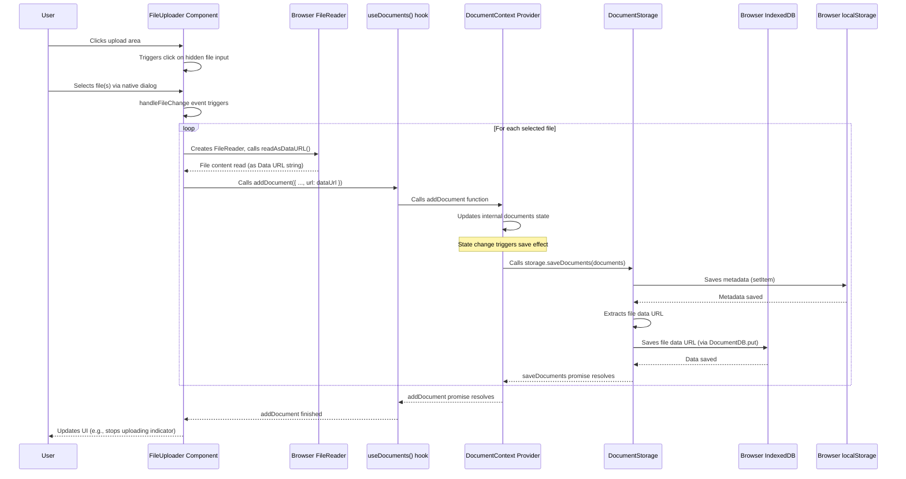

# Chapter 7: File and Download Utilities

Welcome back to the Quillon tutorial! We've now built a comprehensive understanding of how Quillon works: from managing state centrally with Contexts ([Chapter 1: State Management (React Contexts)](01_state_management__react_contexts__.md)) and handling the core data types (Notes and Documents, [Chapter 2: Notes & Documents](02_notes___documents_.md)), to saving everything persistently ([Chapter 3: Local Data Persistence](03_local_data_persistence_.md)), creating the visual interface with components ([Chapter 4: User Interface Components](04_user_interface_components__.md)), finding your notes with filtering and search ([Chapter 5: Note Filtering and Search](05_note_filtering_and_search__.md)), and adding a layer of privacy ([Chapter 6: Private Space Feature](06_private_space_feature__.md)).

In this final chapter, we'll focus on how Quillon deals with actual files that you bring into the application (like documents) and how you can export your information (like downloading a note). This involves a set of helper functions and components dedicated to handling user-uploaded files and facilitating downloads.

### Bringing Files In, Taking Data Out

Imagine you have a PDF document you want to keep alongside your notes, or perhaps you've written an important note in Quillon and want to save it as a text file or PDF on your computer. Quillon needs tools to manage these tasks.

The challenge is interacting with the user's local file system from a web browser, which requires specific browser APIs and careful handling of file data.

**Use Case Example:**

You want to upload a PDF document and then download one of your notes as a `.txt` file. This chapter explains how Quillon makes this possible.

Quillon tackles this by providing utility functions and integrating them into the relevant UI components.

### Handling File Uploads

To allow users to bring files into Quillon, we need:

1.  A way for the user to select files from their computer.
2.  A way to read the content of the selected file.
3.  A way to store this file content within Quillon's local persistence system ([Chapter 3](03_local_data_persistence__.md)).
4.  Components to manage the uploaded files.

Quillon uses the standard HTML file input and the browser's `FileReader` API to get the file content, then saves it using the `DocumentContext` and `DocumentStorage` (which uses `IndexedDB` for the actual file data, as discussed in [Chapter 3](03_local_data_persistence__.md)).

The primary UI component for this is `FileUploader` (`src/components/FileUploader.tsx`).

Let's look at a simplified version of `FileUploader`:

```typescript
// src/components/FileUploader.tsx (Simplified)
import React, { useRef, useState } from 'react';
import { Upload } from 'lucide-react';
import { useDocuments } from '../context/DocumentContext'; // To add documents

export function FileUploader() {
  const { addDocument } = useDocuments(); // Get the function to add a document
  const fileInputRef = useRef<HTMLInputElement>(null); // Ref to the hidden file input
  const [uploading, setUploading] = useState(false);

  const handleFileChange = async (e: React.ChangeEvent<HTMLInputElement>) => {
    const files = Array.from(e.target.files || []); // Get selected files
    if (files.length === 0) return;

    setUploading(true);

    try {
      for (const file of files) {
        // Read file content as a Data URL (base64)
        const base64: string = await new Promise((resolve) => {
          const reader = new FileReader();
          reader.onloadend = () => resolve(reader.result as string);
          reader.readAsDataURL(file); // Read the file!
        });

        // Prepare document data object
        const documentData = {
          name: file.name,
          type: file.type,
          size: file.size,
          url: base64, // Store the file content as a Data URL
          isPinned: false,
          isStarred: false,
        };

        await addDocument(documentData); // Call the Context function to save it
      }
    } catch (error) {
      console.error("Upload failed:", error);
      // Handle errors (e.g., show error message in UI)
    } finally {
      setUploading(false);
      if (fileInputRef.current) {
        fileInputRef.current.value = ''; // Clear input for next upload
      }
    }
  };

  return (
    <div>
      {/* Visually clickable area (styled with Tailwind) */}
      <div
        onClick={() => !uploading && fileInputRef.current?.click()} // Trigger click on hidden input
        className={`... ${uploading ? 'cursor-not-allowed' : 'cursor-pointer hover:border-blue-500'}`}
      >
        <Upload className="..." />
        <p className="...">
          {uploading ? 'Uploading...' : 'Click to upload or drag and drop'}
        </p>
      </div>

      {/* The actual hidden file input */}
      <input
        ref={fileInputRef}
        type="file"
        multiple // Allow multiple files
        onChange={handleFileChange} // Call our handler when files are selected
        className="hidden" // Hide the default input
        accept=".pdf,.doc,.docx,.txt,..." // Specify allowed file types
        disabled={uploading}
      />
    </div>
  );
}
```

**Explanation:**

*   A hidden `<input type="file">` element is created.
*   A `div` is styled to look like a drop zone or clickable area. Clicking this `div` programmatically triggers a click on the hidden input using `fileInputRef.current?.click()`.
*   When the user selects files via the native browser file picker, the `onChange` event on the hidden input fires, calling `handleFileChange`.
*   `handleFileChange` uses `FileReader` to read each file as a Data URL (a string representation of the file content, often base64 encoded). This allows us to store the file content directly in `IndexedDB`.
*   Once the file is read, an object matching the `Document` interface structure ([Chapter 2](02_notes___documents__.md)) is created, including the Data URL in the `url` property.
*   Finally, `addDocument` from `useDocuments()` is called with this object. As we saw in [Chapter 3](03_local_data_persistence__.md), this function in the `DocumentContext` then uses `DocumentStorage` to persist the document metadata and the file data (`url`) locally.

Errors during upload (like exceeding size limits, enforced by `DocumentStorage`) are caught and handled, often displaying a message to the user.

**Sequence Diagram: File Upload**



This diagram illustrates how the `FileUploader` reads the file content and then passes it to the `DocumentContext`'s `addDocument` function, which orchestrates saving the different parts of the document data to the appropriate local storage mechanisms via `DocumentStorage`.

### Displaying Uploaded Files

Once documents are uploaded and saved, they need to be displayed to the user. This is handled by components like `DocumentCard` (`src/components/DocumentCard.tsx`) and potentially `AttachmentList` and `AttachmentPreview` if documents are linked to notes (though Quillon primarily treats uploaded files as standalone "Documents" managed in their own section, not typically attached *within* a specific Note's content area).

`DocumentCard` displays key information about an uploaded file. It gets the `Document` object as a prop ([Chapter 4](04_user_interface_components__.md)).

```typescript
// src/components/DocumentCard.tsx (Simplified)
import React from 'react';
import { Download, Pin, Star, FileText } from 'lucide-react'; // Icons
import { Document } from '../types/document'; // Document interface
import { useDocuments } from '../context/DocumentContext'; // For actions

interface DocumentCardProps {
  document: Document; // Receives the document data
}

export function DocumentCard({ document }: DocumentCardProps) {
  const { updateDocument, deleteDocument } = useDocuments(); // Get action functions

  const formattedDate = new Date(document.updatedAt).toLocaleDateString();

  // Handles downloading the file (we'll see this function soon)
  const handleDownload = () => {
     const link = document.createElement('a');
     link.href = document.url; // The Data URL saved in IndexedDB
     link.download = document.name; // Suggest filename
     document.body.appendChild(link);
     link.click(); // Trigger download
     document.body.removeChild(link);
  };

  return (
    <div className="bg-white dark:bg-gray-800 rounded-lg shadow-md p-4 ..."> {/* Styled with Tailwind */}
      <div className="flex items-center justify-between mb-3">
        <div className="flex items-center gap-2">
          {/* Icon based on file type (potentially using a helper, see below) */}
          <FileText className="h-5 w-5 text-gray-500 ..." /> 
          <h3 className="font-medium text-gray-800 dark:text-gray-200 truncate">
            {document.name} {/* Display file name */}
          </h3>
        </div>
        <div className="flex gap-2">
           {/* Pin and Star buttons using updateDocument from context */}
          <button onClick={() => updateDocument(document.id, { isPinned: !document.isPinned })} className="...">
            <Pin className={`h-4 w-4 ${document.isPinned ? 'fill-current' : ''}`} />
          </button>
          <button onClick={() => updateDocument(document.id, { isStarred: !document.isStarred })} className="...">
            <Star className={`h-4 w-4 ${document.isStarred ? 'fill-current text-yellow-500' : ''}`} />
          </button>
        </div>
      </div>

      {/* Display file size */}
      <div className="text-sm text-gray-500 dark:text-gray-400 mb-3">
        {(document.size / 1024 / 1024).toFixed(2)} MB
      </div>

      <div className="flex justify-between items-center text-xs text-gray-500 dark:text-gray-400">
        <span>{formattedDate}</span> {/* Display updated date */}
        <div className="flex gap-2">
           {/* Download button */}
          <button onClick={handleDownload} className="..." title="Download file">
            <Download className="h-4 w-4" />
          </button>
           {/* Delete button using deleteDocument from context */}
          <button onClick={() => deleteDocument(document.id)} className="..." title="Delete file">
            <Trash2 className="h-4 w-4" />
          </button>
        </div>
      </div>
    </div>
  );
}
```

**Explanation:**

*   `DocumentCard` receives the `document` object via props.
*   It uses `document.name`, `document.size`, and `document.updatedAt` to display information about the file.
*   It uses `useDocuments()` to get `updateDocument` and `deleteDocument` functions, allowing the user to pin, star, or delete the document, updating the state in `DocumentContext`.
*   It includes a "Download" button that calls a local `handleDownload` function, which accesses the `document.url` (the Data URL containing the file content) to create a temporary link and trigger the download in the browser. This is a standard browser technique for client-side downloads.

### Helping with File Details: `attachmentUtils.ts`

The `attachmentUtils.ts` file provides small helper functions primarily for dealing with file types and displaying relevant icons. While named "attachment" utilities, these functions are often useful when displaying any file information in the UI, including standalone Documents.

```typescript
// src/utils/attachmentUtils.ts (Simplified)
import { FileText, Image, Video, Music } from 'lucide-react';
// Assuming Attachment type is similar structure to Document for relevant fields

export const getAttachmentIcon = (type: string) => {
  // Returns the appropriate Lucide icon component based on MIME type string (e.g., "image/png")
  if (type.startsWith('image/')) return Image;
  if (type.startsWith('video/')) return Video;
  if (type.startsWith('audio/')) return Music;
  return FileText; // Default icon
};

export const getAttachmentType = (mimeType: string): 'image' | 'video' | 'audio' | 'document' => {
   // Classifies the MIME type into a simpler category
   if (mimeType.startsWith('image/')) return 'image';
   if (mimeType.startsWith('video/')) return 'video';
   if (mimeType.startsWith('audio/')) return 'audio';
   return 'document'; // Catch-all for other documents
};

export const handleAttachmentDownload = (attachment: { name: string, url: string }) => {
  // This is similar to the handleDownload function in DocumentCard
  const link = document.createElement('a');
  link.href = attachment.url; // Data URL or regular URL
  link.download = attachment.name;
  document.body.appendChild(link);
  link.click();
  document.body.removeChild(link);
};
```

**Explanation:**

*   `getAttachmentIcon` is used by components that display file lists (`DocumentCard`, `AttachmentManager`) to show a visual cue (like a video icon for a video file) next to the filename. It takes the file's MIME type (a string like "image/jpeg" or "application/pdf") and returns the correct icon component from a library like `lucide-react`.
*   `getAttachmentType` simplifies the MIME type into broader categories (image, video, audio, document). This might be used for conditional rendering or further logic.
*   `handleAttachmentDownload` provides a reusable function for triggering downloads from a Data URL or regular URL, which is used in several components (`DocumentCard`, `NoteViewer`, `AttachmentManager`).

Components would use `getAttachmentIcon` like this:

```typescript
// Simplified snippet showing how to use getAttachmentIcon
import { getAttachmentIcon } from '../utils/attachmentUtils';
import { Document } from '../types/document';

function DocumentCard({ document }: { document: Document }) {
    const Icon = getAttachmentIcon(document.type); // Get the correct icon component
    return (
        <div className="...">
            <div className="flex items-center gap-2">
                <Icon className="h-5 w-5 text-gray-500 ..." /> {/* Render the icon */}
                <h3 className="..."> {document.name} </h3>
            </div>
            {/* ... rest of the card */}
        </div>
    );
}
```

### Handling Note Downloads: `downloadUtils.ts`

Notes are text-based content written directly in Quillon, not uploaded files. However, users might want to download them as standard file formats like `.txt` or `.pdf`. The `downloadUtils.ts` file contains functions specifically for this purpose.

The main function here is `downloadNote`:

```typescript
// src/utils/downloadUtils.ts (Simplified)
import { Note } from '../types';

interface DownloadOptions {
  format: 'txt' | 'pdf';
  suggestedName?: string;
}

export async function downloadNote(note: Note, options: DownloadOptions) {
  const { format, suggestedName } = options;

  // Create a filename (e.g., "My Note Title.txt")
  const defaultFileName = suggestedName || `note-${new Date().getTime()}`;
  const fileName = `${defaultFileName}.${format}`;

  // Combine note data into a single string for TXT/PDF
  const content = `${note.title}\n\n${note.content}${note.tags.length ? '\n\nTags: ' + note.tags.join(', ') : ''}`;

  if (format === 'txt') {
    // Create a file-like object (Blob) from the text content
    const blob = new Blob([content], { type: 'text/plain;charset=utf-8' });

    try {
      // Attempt to use the modern File System Access API (better save dialog)
      if ('showSaveFilePicker' in window) {
        const handle = await window.showSaveFilePicker({
          suggestedName: fileName,
          types: [{ description: 'Text file', accept: { 'text/plain': ['.txt'] } }]
        });
        const writable = await handle.createWritable();
        await writable.write(blob);
        await writable.close();
      } else {
        // Fallback for older browsers: create a temporary link and click it
        const url = URL.createObjectURL(blob); // Create a temporary URL for the blob
        const link = document.createElement('a');
        link.href = url;
        link.download = fileName;
        document.body.appendChild(link);
        link.click(); // Simulate a click to trigger download
        document.body.removeChild(link);
        URL.revokeObjectURL(url); // Clean up the temporary URL
      }
    } catch (err) {
       // Handle errors, e.g., user cancels dialog
       if (err.name !== 'AbortError') { console.error('Failed to save file:', err); }
       // Optionally fall back to the traditional method if FS Access API fails unexpectedly
    }

  } else if (format === 'pdf') {
    // For PDF: render content in a new window and trigger print dialog
    // The browser's print-to-PDF feature does the conversion
    const printWindow = window.open('', '', 'width=800,height=600');
    if (printWindow) {
        printWindow.document.write(`
            <html>
            <head>
                <title>${note.title}</title>
                <style> /* Basic styling for the PDF */ </style>
            </head>
            <body>
                <h1>${note.title || 'Untitled Note'}</h1>
                <div class="metadata"> ... date, flags ... </div>
                <div class="content"> ... note content ... </div>
                <div class="tags"> ... tags ... </div>
                <script>
                    window.print(); // Open print dialog
                    window.onafterprint = function() { window.close(); }; // Close window after print
                </script>
            </body>
            </html>
        `);
        printWindow.document.close();
    }
  }
}
```

**Explanation:**

*   `downloadNote` takes a `Note` object and desired `format` (`txt` or `pdf`).
*   For `.txt` format: It formats the note's title, content, and tags into a single string. It then creates a `Blob` (a file-like object) from this string. It tries to use the modern `showSaveFilePicker` API for a better user experience; if not available, it falls back to the traditional method of creating a temporary download link using `URL.createObjectURL`.
*   For `.pdf` format: It takes a different approach, opening the note content in a new browser window with HTML structure and CSS for basic formatting. It then immediately calls `window.print()`. Browsers often include a "Save as PDF" option in their print dialog, effectively creating a PDF from the rendered HTML.

These download functions are called from UI components that display notes, such as `NoteCard` and `NoteViewer`.

```typescript
// src/components/NoteCard.tsx (Snippet)
import { Download, ChevronDown } from 'lucide-react';
import { downloadNote } from '../utils/downloadUtils'; // Import the utility

function NoteCard({ note, onEdit }: NoteCardProps) {
  // ... other component logic ...

  const handleDownload = async (format: 'txt' | 'pdf') => {
    await downloadNote(note, { format }); // Call the utility function
    // Close any download options menu
    setShowFormatOptions(false);
  };

  return (
     <div className="...">
       {/* ... note content and other buttons ... */}
       <div className="flex gap-2">
         {/* ... other buttons ... */}
         {/* Download button with format options */}
         <div className="relative" ref={formatOptionsRef}> {/* Ref for closing on outside click */}
           <button
             onClick={() => setShowFormatOptions(!showFormatOptions)} // Toggle options visibility
             className="..."
             title="Download note"
           >
             <Download className="..." />
             <ChevronDown className="..." />
           </button>
           {showFormatOptions && (
             <div className="absolute right-0 bottom-full mb-1 ..."> {/* Options menu */}
               <button
                 onClick={() => handleDownload('txt')} // Call handler for TXT
                 className="..."
               >
                 Download TXT
               </button>
               <button
                 onClick={() => handleDownload('pdf')} // Call handler for PDF
                 className="..."
               >
                 Download PDF
               </button>
             </div>
           )}
         </div>
         {/* ... other buttons (Edit, Trash, etc.) */}
       </div>
     </div>
  );
}
```

**Explanation:**

*   The `NoteCard` component includes a download button.
*   Clicking the main download button shows a small dropdown menu with format options (`TXT`, `PDF`).
*   Clicking a format option calls the local `handleDownload` handler.
*   This handler in turn calls the shared `downloadNote` utility function, passing the `note` object and the selected `format`.

The `NoteViewer` component (`src/components/NoteViewer.tsx`) has similar logic for its download button.

### Summary of File and Download Utilities

| Component/Utility     | Purpose                                                                 | Key Technologies/Concepts Involved                           | Interaction Points                                      |
| :-------------------- | :---------------------------------------------------------------------- | :----------------------------------------------------------- | :------------------------------------------------------ |
| `FileUploader`        | Provides UI for selecting and initiating file uploads.                  | HTML `input type="file"`, `FileReader` API, React `useRef`, `useState` | Calls `addDocument` from `useDocuments()`             |
| `DocumentCard`        | Displays information about an uploaded Document and provides actions.   | React props, Tailwind CSS, `URL.createObjectURL`             | Calls `updateDocument`, `deleteDocument` from `useDocuments()`; calls `handleAttachmentDownload` |
| `AttachmentManager`   | Manages a list of standalone attachments (similar to documents in concept). | React `useState`, `useEffect` (for local saving), `localStorage` | Uses `FileUploader`; calls `handleAttachmentDownload`, `getAttachmentIcon` |
| `AttachmentPreview`   | Renders appropriate preview for different attachment types.               | React props, conditional rendering, HTML `<video>`, ``, `<audio>` | Uses `attachment.type`, `attachment.url`, `attachment.name` |
| `attachmentUtils.ts`  | Helper functions for file type classification, icons, and downloads.    | JavaScript string methods (`startsWith`), Browser APIs       | Used by `DocumentCard`, `AttachmentManager`, `AttachmentPreview` |
| `downloadUtils.ts`    | Helper functions for downloading notes.                                 | JavaScript `Blob`, `URL.createObjectURL`, `showSaveFilePicker`, `window.print()` | Called by `NoteCard`, `NoteViewer`                    |
| `DocumentContext`     | Central state management for the list of `Document` objects.            | React Context, `useState`, `useEffect`                       | Provides `documents` array, `addDocument`, `updateDocument`, `deleteDocument` |
| `DocumentStorage`     | Handles persistence logic for Documents.                                | `localStorage` (metadata), `IndexedDB` (file data), Promises | Used *by* `DocumentContext` internally                  |

These utilities and components work together, often orchestrated by the `DocumentContext`, to provide a seamless experience for the user to bring files into Quillon and export their notes and files back out.

### Conclusion

In this final chapter, we explored Quillon's file and download utilities. We saw how the `FileUploader` component uses browser APIs to read user-selected files and pass their data to the `DocumentContext` for storage via `DocumentStorage`. We also learned how utilities like `downloadUtils.ts` and `attachmentUtils.ts`, integrated into components like `NoteCard`, `NoteViewer`, and `DocumentCard`, handle the client-side process of generating and triggering downloads for notes and uploaded files.

This concludes our tutorial series on the Quillon project. You've journeyed from the foundational concepts of state management and data structure through persistence, building the user interface, adding core features like filtering and privacy, and finally, handling file interactions.

By understanding these core concepts and how they are implemented and connected within Quillon's React structure, you have a solid basis for exploring the codebase further, modifying existing features, or adding new ones.

Thank you for following along!
