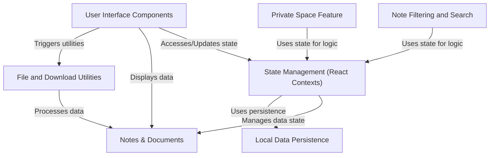

d# Tutorial: Quillon

Quillon is a web application for organizing **notes** and **documents** directly
in your browser. It offers **local data persistence** ensuring your information
is saved offline. You can use **filters** and **search** to quickly find
what you need and protect sensitive notes with a **private space**.

## Visual Overview

## Chapters

1. [State Management (React Contexts)
](01_state_management__react_contexts__.md)
2. [Notes & Documents
](02_notes___documents_.md)
3. [Local Data Persistence
](03_local_data_persistence_.md)
4. [User Interface Components
](04_user_interface_components_.md)
5. [Note Filtering and Search
](05_note_filtering_and_search_.md)
6. [Private Space Feature
](06_private_space_feature_.md)
7. [File and Download Utilities
](07_file_and_download_utilities_.md)
